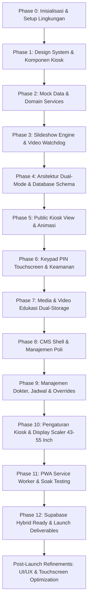

# DOKUMENTASI LENGKAP PENGEMBANGAN & LOG PROMPT HISTORIS
## KIOSK JADWAL POLIKLINIK RSUD H. ANDI SULTHAN DAENG RADJA KABUPATEN BULUKUMBA

> **Tujuan File (`promp.md`)**:
> File ini merangkum seluruh rekam jejak instruksi, prompt pengguna, komentar khusus (*user directives*), keputusan arsitektural, aturan desain, dan implementasi kode mulai dari **PHASE 0 hingga FINAL LAUNCH & POST-LAUNCH REFINEMENTS**.
> Jika di kemudian hari dilakukan pengembangan atau modifikasi lanjutan, AI Assistant / Developer dapat membaca file ini agar konsistensi desain, logika bisnis, dan keinginan pengguna tetap terjaga 100%.

---

## 📌 1. PARAMETER UTAMA & SPESIFIKASI PROYEK

| Parameter | Keterangan Spesifikasi |
|:---|:---|
| **Nama Aplikasi** | Kiosk Jadwal Poliklinik & CMS Administrasi Rumah Sakit |
| **Instansi / Lokasi** | RSUD H. Andi Sulthan Daeng Radja, Kabupaten Bulukumba, Sulawesi Selatan |
| **Zona Waktu** | WITA (`Asia/Makassar`, UTC+8) |
| **Hardware Target** | TV Android Komersial / Display Monitor Vertikal Portrait (Rentang fisik **43" hingga 55" inch**) |
| **Resolusi Rasio** | 1080 × 1920 (Portrait 9:16) |
| **Tech Stack** | SvelteKit 2 + Svelte 5 (Runes `$state`, `$derived`, `$props`, `$effect`), TypeScript, Vite, Lucide Svelte |
| **Database & Cloud** | Dual-Mode Hybrid: Local-First Offline (IndexedDB / LocalStorage / Service Worker) + Supabase Cloud (PostgreSQL, Realtime, Storage) |
| **Autentikasi CMS** | Virtual Keypad Master PIN Touchscreen (default: `1234` / `123456`) dengan proteksi Brute-Force Rate Limiter & Idle Auto-Lock |
| **Status Poliklinik** | 5 Status Otomatis & Override: BUKA (Hijau), ISTIRAHAT (Kuning), TUTUP (Abu-abu), LIBUR (Merah), SEGERA/AKAN DATANG (Biru) |

---

## 💬 2. REKAM JEJAK KOMENTAR & ARAHAN KHUSUS PENGGUNA (USER DIRECTIVES)

Berikut adalah daftar seluruh komentar, koreksi, dan arahan spesifik yang diberikan oleh pengguna selama percakapan:

### 1. Arahan Durasi & Audio Video di Android TV (Phase 3)
* **Komentar Pengguna**:
  > *"berikan saya pengaturan atau info dalam melakukan customisasi durasi ini dalam sub menu tambahan, buat sederhana saja"*
  > *"pastikan media tetap dapat terputar dengan baik, serta mengelurakan suara di android tv"*
* **Implementasi**:
  * Ditambahkan pengaturan durasi tayang per-slide pada CMS.
  * Tag `<video>` dikonfigurasi dengan atribut `playsinline`, auto-play dengan fallback teredam sementara jika dibatasi kebijakan browser Android TV, serta toggle `video_sound_enabled` pada pengaturan CMS untuk menjamin audio edukasi pasien terdengar jelas di TV.

### 2. Arahan Dual-Mode Supabase: Pengujian Offline Dahulu (Phase 4)
* **Komentar Pengguna**:
  > *"iplementasi database ke suapbase ini akan dilakukan ketika pengujian di environmend production sudah berjalan semua dengan baik dan sesuai dengan prd, jadi untuk koneksi ke supbase akan dilakukan di akhir sekali step ketika sudah siap di launcing dalam web base secara online, jadi tetap mungkinkan juga untuk tetsting dan pengorasian dalam envoronmen production terlebih dahulu sebelum di up ke launcing di akhir"*
* **Implementasi**:
  * Arsitektur dibuat *Local-First Dual Mode*. Aplikasi dapat dijalankan dan diuji 100% tanpa internet menggunakan cache lokal, dan modul Supabase dirancang siap-pakai (*hot-swappable*) pada fase peluncuran akhir tanpa merusak fungsionalitas lokal.

### 3. Opsi Video Lokal TV untuk File Ukuran Besar (Phase 7)
* **Komentar Pengguna**:
  > *"untuk video berikan saya opsi tambahan dimana saya bisa memasukkan video lokal di perangkat yg di runningkan semisal saya memiliki video dengan ukuran besar, alih" melakukan upload ke database yg membebankan, saya berencana mengkaitkan videonya di lokal internal storage saja, dengan menaitkan pathnya di lokal storage, tetap tetap juga adakan untuk upload secara onlinenya sehingga bisa masuk database. ini khusus untuk video saja mengingat jika skenario video yg ukuran besar"*
* **Implementasi**:
  * Form media pengumuman di CMS menyediakan 3 opsi penyimpanan:
    1. **Online URL**: Link HTTP/HTTPS.
    2. **Upload File**: Upload file poster gambar atau video via CMS.
    3. **Jalur File Lokal (`local_path`)**: Menautkan path absolut internal storage Android TV (misal `/static/videos/edukasi-layanan.mp4` atau `/storage/emulated/0/Movies/...`), menghemat kuota internet dan beban database cloud.

### 4. Fleksibilitas Ukuran Layar TV 43"–55" (Phase 8)
* **Komentar Pengguna**:
  > *"untuk ukuran display ini bukan ukuran fix 55\" tapi tv ini kisaran 43\"-55\" inch dengan view vertikal"*
* **Implementasi**:
  * Desain viewport Kiosk dibuat dinamis berbasis CSS variable scaling (`--font-scale`, `--card-scale`, `--header-scale`, `--footer-scale`) sehingga pas secara proporsional baik pada layar TV 43 inch, 50 inch, maupun 55 inch portrait.

### 5. Konsistensi Tombol 'Tampilkan Kiosk' dan 'Kunci Kiosk' (Refinement 1)
* **Komentar Pengguna**:
  > *"ada tambahan dari saya untuk disetiap pilihan menu saya ingin kamu konsisten menampilkan menu tampilkan kiosk dan menu kunci kiosk seperti terlampir"*
* **Implementasi**:
  * Sidebar CMS dibuat *sticky* dan dilengkapi dua tombol permanen:
    * **Tampilkan Kiosk** (Warna Hijau Tua `#0A5C36`, teks putih tegas).
    * **Kunci Kiosk** (Latar merah muda lembut `#FFF1F2`, teks merah karang `#EF4444`).
  * Kedua tombol juga disematkan pada baris *topbar* di seluruh halaman CMS.

### 6. Pengamanan Akses Rute Admin saat Kiosk Terkunci (Refinement 2)
* **Komentar Pengguna**:
  > *"perbaiki akses admin pagenya dimana ketika dalam kondisi terkunci, user tetap bisa mengakses admin page =, dengan mengubah localhost/admin, padahal user belum memasukkan pin, dan kondisi terkunci"*
* **Implementasi**:
  * Ditambahkan *strict client-side route guard* pada `src/routes/admin/+layout.svelte` dan `src/routes/admin/+layout.ts` (`ssr = false`).
  * Jika sesi belum terverifikasi PIN atau dalam kondisi terkunci, akses ke rute `/admin/*` otomatis diblokir dan langsung dialihkan (*redirect*) ke `/admin/login`.

### 7. Login Khusus PIN & Gradasi Header Oranye-Hijau (Refinement 3)
* **Komentar Pengguna**:
  > *"1. http://localhost:5173/admin/login, terdapat opsi login pin dan login akun email dan pass, hilangkan saja login email cukup dengan pin saja"*
  > *"2. saya ingin gradasi warna headernya backgroundnya lebih bagus lagi dimana seperti lampiran gradasinya antara orange dan hijau ada di tengah seperti terlampir"*
* **Implementasi**:
  * Opsi login email/password pada `/admin/login` dihapus; antarmuka disederhanakan menjadi Virtual Keypad PIN touchscreen.
  * Gradasi latar belakang header Kiosk disempurnakan menggunakan formula multi-stop Oklab halus:
    `linear-gradient(100deg, #DF5720 0%, #DF5720 30%, #DA6226 36%, #B57933 46%, #578B45 56%, #178750 66%, #0E7743 82%, #0A5C36 100%)`.

### 8. Interaktivitas Layar Kiosk & Dinamika Ikon Gembok (Refinement 4)
* **Komentar Pengguna**:
  > *"tambahan saya ingin ketika dashboard cmdnya dibuka atau tidak terkunci, tampilan preview di dashboardnya bisa di sentuh kembali, namun ketika dashboard terkunci preview kiosk jadwalnya tidak dapat disentuh kembali kecuali ikon gembok yg merupakan akses dashboardnya, selanjutnya saya junga ingin perubahan icon ketika dashboard dibuka makan icon gembok menjadi terbuka, namun ketika terkunci kembali maka icon gembok terkunci kembali juga"*
* **Implementasi**:
  * Saat Kiosk terkunci: Layar konten jadwal menerapkan `pointer-events: none !important`, sedangkan tombol gembok header tetap `pointer-events: auto !important`.
  * Ikon gembok berubah dinamis: gembok tertutup 🔒 saat terkunci, gembok terbuka 🔓 beraksen emerald glow saat terbuka.
  * Menekan gembok terbuka memunculkan dialog pilihan aksi (buka dashboard CMS, kunci kembali, atau tetap di layar kiosk).
  * Di dalam Dashboard CMS ditambahkan modal *Live Interactive Simulator Kiosk*.

### 9. Usap Sentuh (Swipe), Header Ringkas & Halaman Media Simpel (Refinement 5)
* **Komentar Pengguna**:
  > *"1. temun saya ketika kunci terbuka dan layar tetap di layar kiosk, saya tetap tidak dapat menyentuh, diman saaya harapkan dapap mengeser card halan lebih cepat, atau dapat menyentuh konten di jadwalnya"*
  > *"2. saya ingin di header tulisan jadwal poliklinknya di perkecil saja, dan sehingga headernya dapat lebih kecil lagi dan jika ada ruang kosong perkecil juga khususnya di antara tulisan kabupaten bulukumba dan Jadwal Poliklink, ada gap kosong."*
  > *"3. informasi pada page media, saya ingin kamu buat kecil dan simpel saja jangan terlalu banyak memakan tempat di page utamanya"*
* **Implementasi**:
  * Diterapkan gestur usap layar sentuh (*touch swipe* kiri/kanan).
  * Kartu dokter dapat disentuh dan memunculkan popover modal *Detail Praktik Dokter*.
  * Judul "JADWAL POLIKLINIK" diperkecil (`1.15rem`–`1.2rem`) dan header dipadatkan.
  * 4 kotak statistik raksasa pada `/admin/media` dihapus dan diganti bilah ramping (*toolbar strip*) setinggi ~45px dengan pill badges.

### 10. Keseimbangan Gap Header, Penghapusan Overlay Panah, dan Footer Ramping (Refinement 6)
* **Komentar Pengguna**:
  > *"1. di header, jangan hilangkan juga gap antara tulisan kabupaten bulukumba dan tulisan jadwal poliklinik, tetap ada gap tapi tidak perlu terlau besar, dan juga saya ingin logo, tulisan rsud, dan tanggalnya di perbesar sedikit saja"*
  > *"2. hilangkan nafigasi sebelum dan berikutnya, saat kiosk di buka kuncinya, karen adengan touch screen sudah dapat dilakukan"*
  > *"3. tulisan 4 item di footer, perkecil gapnya dan buat agak turun sedikit agr konten dapat terlihat maksimal, tapi jangan hapus nol gapnya tetap ada tapi memaksimalkan ruang tampil saja"*
* **Implementasi**:
  * Header: Diberi gap seimbang (`margin-bottom: 0.65rem`), logo diperbesar ke `62px`–`80px`, nama RSUD diperbesar ke `1.42rem`–`1.65rem`, dan tanggal diperbesar ke `0.8rem`.
  * Tombol navigasi mengambang ("Sebelumnya" / "Berikutnya") dihapus total agar layar bersih; navigasi murni mengandalkan *touch swipe* dan *page dots*.
  * Footer: Gap 4 kartu informasi diperkecil (`0.4rem 0.55rem`), padding kartu dipadatkan (`0.45rem 0.85rem`), dan posisinya diturunkan mendekati running text agar konten jadwal di tengah maksimal.

### 11. Persistensi Data Disk Lokal, Upload Berkas Fisik, dan Generator SQL Supabase (Refinement 7)
* **Komentar Pengguna**:
  > *"saat saya melakukan testing aplikasinya, dan saya melakukan input upload gambar perubahan terterapkan, namun ketika saya mematikan projectnya dan membuka kembali project inputan atau perubahan yg saya lakukan terreset mohon berikan penjelasan dan lakukan perbaikan, saya ingin menguji di enovprtmen ini, dengan menambah data serta melengkapai data, kemudian nanti saya akan deploy ke hosting dan supabase, agar pengembangan selanjutnya dapat di lakukan secara online dan dimana saja"*
  > *"saya ingin kamu tambahkan alert ketika gambar atau media yg di upload berhasil, ingat upload image atau media ini ada di menu data dokter (foto dokter), upload logo rs (header), kemudian di menu media (media gambar dan videonya)"*
* **Implementasi**:
  * Ditambahkan endpoint API `/api/upload` yang menyimpan file secara nyata ke `static/uploads/announcements/`, `static/uploads/doctors/`, dan `static/uploads/logos/`, bebas dari batasan kuota 5MB browser.
  * Ditambahkan endpoint API `/api/data` dan berkas fisik `data/local-db.json` agar seluruh data poliklinik, dokter, jadwal, dan settings tersimpan permanen di harddisk dan tidak hilang saat project dimatikan atau di-restart.
  * Ditambahkan alert visual hijau dan indikator loading di 3 lokasi upload: foto dokter, logo RSUD di header, dan media gambar/video.
  * Ditambahkan fitur 1-Klik "Ekspor Seluruh Data Lokal ke SQL Supabase" di CMS Cloud Settings sehingga data lokal yang telah diisi dapat langsung dieksekusi di Supabase SQL Editor.

### 12. Perbesaran Card Foto Dokter, Aksi Cepat Gulir Dropdown, dan Responsive Web Design (RWD) Smartphone (Refinement 8)
* **Komentar Pengguna**:
  > *"saya ingin melakukan update customisasi yaitu:*
  > *1. saya ingin card foto dokter di tampilan jadwal poli bisa lebih besar lagi*
  > *2. saya ingin di dashboard cms, dimenu Dokter dan jadwal, untuk aksi cepat petugas di buat pilihan gulir pilih saja, serta kategorinya dimasukkan semua, termasuk buka tutup libur dan istirahat*
  > *3. tampilan web dashboard yg interaktif dalam artian dapat di oprasikan perubahan data jika dibuka di tampilan smartphone atau lainnya dalam artian Responsive Web Design (RWD)"*
* **Implementasi**:
  * **Perbesaran Foto Dokter Kiosk (`DoctorCard.svelte`)**:
    * Bingkai foto dokter diperbesar dari `84px × 88px` menjadi `124px × 136px` dengan grid `124px 1fr auto` dan border radius `1.15rem`.
    * Inisial placeholder diperbesar menjadi `2.4rem` font weight 800, serta nama dokter menjadi `1.35rem` bold.
    * Menambahkan media query responsif sehingga tetap proporsional pada pratinjau mobile.
  * **Pilihan Gulir (Dropdown) Aksi Cepat CMS (`doctors-jadwal/+page.svelte`)**:
    * Kolom "Aksi Cepat Petugas" pada tab "Status Praktik Hari Ini" diganti dari tombol-tombol sempit menjadi elemen gulir `<select>` dengan opsi lengkap: `⚡ Otomatis (Ikuti Jadwal)`, `🟢 BUKA (Sedang Praktik)`, `🟡 ISTIRAHAT`, `⚪ TUTUP (Selesai Praktik)`, `🔴 LIBUR (Cuti / Izin)`, dan `❌ DIBATALKAN`.
    * Eksekusi instan: begitu opsi dipilih, status langsung diupdate di `DataRepository` dan disimpan ke disk lokal `data/local-db.json`.
    * Banner alert notifikasi hijau muncul seketika di atas tabel: *"Status dr. [Nama] berhasil diubah menjadi [STATUS]"*.
    * Tombol ikon pensil disediakan di samping select untuk memberikan catatan kustom kiosk jika diperlukan.
  * **Responsive Web Design (RWD) Interaktif Dashboard CMS**:
    * Layout CMS (`admin/+layout.svelte`) dilengkapi tombol menu hamburger dan drawer off-canvas yang bergeser mulus dari sisi kiri dengan backdrop blur pada viewport mobile (`< 900px`).
    * Drawer tertutup otomatis saat link menu diklik atau rute berubah.
    * Seluruh tabel di admin (`doctors-jadwal`, `poli`, `media`, `kiosk-settings`) menerapkan wrapper scroll horizontal touch-friendly (`.table-responsive`) dengan min-width yang terjaga.
    * Modal form dan tombol aksi dioptimalkan dengan padding sentuh standar minimum 44px untuk kenyamanan operasional via smartphone.

### 13. Pengelompokan Master Data Dokter Berdasar Menu Poliklinik & Sinkronisasi ke Realtime Status Praktik Hari Ini (Refinement 9)
* **Komentar Pengguna**:
  > *"selanjutnya di pengaturan lebih dalam di master data dokter saya ingin ada pengelompokan yang berdasar pada data menu poliklinik, serta master datanya di sinkronisasi ke realtime status praktik hari ini. sehingga pada pilihan langsung memgelompokkan dokter kedalam kategori poliklinik apa dia"*
* **Implementasi**:
  * **Relasi Poliklinik pada Master Data Dokter (`Doctor.polyclinic_id`)**:
    * Menambahkan properti opsional `polyclinic_id?: string;` pada `interface Doctor` di `src/lib/types/index.ts`.
    * Memperbarui seluruh data dokter awal di `data/local-db.json` dan inisialisasi `DataRepository` dengan penugasan poliklinik resmi (contoh: Poli Penyakit Dalam, Jantung, Anak, Bedah, dsb.).
  * **Pengelompokan & Filter Poliklinik di Tab 2 (Master Data Dokter)**:
    * Menyediakan dropdown "Kategori Poli" untuk memfilter dokter berdasarkan poliklinik penugasan.
    * Menyediakan toggle switch tampilan: **Kelompok Poli** (default) vs **Daftar Semua**.
    * Pada mode "Kelompok Poli", tabel menampilkan baris header kategori poliklinik dengan badge jumlah dokter terdaftar (`.poli-group-row`), mengelompokkan dokter secara rapi per poliklinik.
    * Menambahkan kolom "Kategori Poliklinik" pada tabel master data dokter.
  * **Form Modal Tambah / Edit Dokter (`#doc-poli`)**:
    * Menambahkan kolom pilihan poliklinik penugasan yang terhubung langsung ke daftar master poliklinik aktif.
    * Saat dokter disimpan atau diedit, relasi poliklinik langsung tersimpan permanen di `data/local-db.json`.
  * **Sinkronisasi Realtime ke Tab 1 (Status Praktik Hari Ini)**:
    * Pada layar "Status Praktik Hari Ini", baris dokter otomatis terkelompok berdasar kategori polikliniknya dengan header kategori elegan dan badge jumlah dokter praktik per poli.
    * Ditambahkan toolbar filter poliklinik di atas tabel status hari ini agar staf dapat melihat status per poliklinik tertentu atau semua poliklinik secara instan.
    * Pilihan gulir aksi cepat petugas tetap berfungsi mulus di setiap kelompok dokter.
  * **Auto-Kategorisasi pada Modal Tambah Jadwal Mingguan (Tab 3)**:
    * Pilihan dokter pada modal tambah jadwal dikelompokkan menggunakan `<optgroup>` berdasarkan nama poliklinik penugasan dokter.
    * Saat nama dokter dipilih, dropdown poliklinik jadwal secara otomatis menyesuaikan ke poliklinik tempat dokter tersebut ditugaskan.

### 14. Posisi Tag Ujung Atas Kiri & Desain Kompak Dialog Card Edukasi Kesehatan Kiosk (Refinement 10)
* **Komentar Pengguna**:
  > *"selanjutnya dibagian tampilan informasi dan edukasi kesehatan saya ingin kotak dialognya di ubah, saya lampirkan foto diatas bagian mana yg saya maksud (ini terletak di tampilan kios pada menu media dan video), saya ingin "informasi dan edukasi kesehatan" ada di ujung atas kiri (kiri tangan saya) kotak dialognya, selanjutnya dialog carnya bisa diperkecil tapi tulisannya tetap jelas"*
* **Implementasi**:
  * **File Terkait**: [src/routes/kiosk/components/AnnouncementSlide.svelte](file:///c:/Users/Administrator/Desktop/Kiosk%20jdwl/src/routes/kiosk/components/AnnouncementSlide.svelte)
  * **Posisi Tag Ujung Atas Kiri (`.announcement-tag`)**:
    * Tag kategori `✨ INFORMASI & EDUKASI KESEHATAN` diposisikan menempel di sudut/ujung atas kiri (`position: absolute; top: 0; left: 0;`).
    * Diberi styling sudut melengkung khusus (`border-top-left-radius: 1rem; border-bottom-right-radius: 0.75rem;`), gradasi hijau lembut (`#E8F5E9` ke `#D1FAE5`), teks hijau tua tegas (`#0A5C36`, `font-weight: 850`), serta border aksen tipis (`#C8E6C9`).
  * **Dialog Card Lebih Kompak (`.announcement-header`)**:
    * Mengurangi padding vertikal berlebih dari `padding: 1.25rem 1.75rem` menjadi `padding: 1.95rem 1.25rem 0.65rem 1.25rem`, memangkas tinggi kartu hampir 45% (dari ~125px menjadi ~67px).
    * Ruang vertikal yang dihemat dialokasikan langsung ke container video/gambar edukasi (`.media-container`) sehingga video dan poster tampak lebih besar, lega, dan memukau pada TV vertikal portrait 9:16.
  * **Ketajaman & Kejelasan Judul (`.announcement-title`)**:
    * Judul pengumuman (`media.title`) tetap berukuran besar dan terbaca jelas dari jarak jauh (`font-size: 1.25rem`, `font-weight: 850`, warna kontras tinggi `#0F172A`).
    * Ditambahkan media query responsif (`@media (max-width: 640px)`) agar tetap proporsional dan tidak terpotong saat dipratinjau di layar smartphone.

### 15. Perbesaran 5% Seluruh Komponen Header Kiosk (Refinement 11)
* **Komentar Pengguna**:
  > *"saya ingin memperbesar sedikit headernya, laukan perbesaran dalam 5% komponen di headernya"*
* **Implementasi**:
  * **File Terkait**:
    - [src/routes/kiosk/components/KioskHeader.svelte](file:///c:/Users/Administrator/Desktop/Kiosk%20jdwl/src/routes/kiosk/components/KioskHeader.svelte)
    - [src/routes/kiosk/components/DigitalClock.svelte](file:///c:/Users/Administrator/Desktop/Kiosk%20jdwl/src/routes/kiosk/components/DigitalClock.svelte)
    - [src/routes/kiosk/components/PageIndicator.svelte](file:///c:/Users/Administrator/Desktop/Kiosk%20jdwl/src/routes/kiosk/components/PageIndicator.svelte)
  * **Peningkatan Proporsional (+5%)**:
    * **Padding Header**: `0.9rem 1.5rem 0.6rem 1.5rem` $\to$ `0.95rem 1.58rem 0.63rem 1.58rem`.
    * **Logo Lingkaran RSUD**: `80px × 80px` $\to$ `84px × 84px`.
    * **Nama Rumah Sakit (`.hospital-name`)**: `1.65rem` $\to$ `1.73rem`.
    * **Sub-identitas RSUD (`.hospital-sub`)**: `0.85rem` $\to$ `0.9rem`.
    * **Pill Instansi & Tanggal (`.instansi-pill`, `.instansi-date`)**: font `0.78rem` $\to$ `0.82rem`, tanggal `0.8rem` $\to$ `0.84rem`.
    * **Jam Digital Realtime (`DigitalClock.svelte`)**:
      * Digit waktu (`.time-digits`): `2.2rem` $\to$ `2.31rem`.
      * Badge container: padding `0.5rem 1.25rem` $\to$ `0.53rem 1.31rem`, min-width `140px` $\to$ `147px`.
      * Hari & temperatur: `0.825rem` $\to$ `0.87rem`.
    * **Tombol Gembok / Akses CMS (`.lock-action-btn`)**: diameter `42px` $\to$ `44px`, ikon `size={22}` $\to$ `size={23}`.
    * **Baris Sub-Header Jadwal Poliklinik**:
      * Judul utama (`.title-main`): `1.2rem` $\to$ `1.26rem`.
      * Sub-teks (`.title-sub`): `0.74rem` $\to$ `0.78rem`, ikon stetoskop `size={18}` $\to$ `size={19}`.
    * **Badge Counter Halaman (`PageIndicator.svelte`)**:
      * Angka halaman (`.badge-number`): `1.25rem` $\to$ `1.31rem`.
      * Label: `0.6rem` $\to$ `0.63rem`, padding `0.35rem 0.9rem` $\to$ `0.37rem 0.95rem`.
    * **Trek Progres Slide (`.progress-track`)**: ketebalan bar `4px` $\to$ `4.5px`.

### 16. Penambahan 24 Poliklinik Resmi, Indeks Urutan (1–24), dan Ikon Visual Lucide (Refinement 12)
* **Komentar Pengguna**:
  > *"saya ingin tambahkan index dan ikon visual dari poliklinik dimana poliklinik yg ada yaitu jantung, jiwa, kulit dan kelamin, mata, orthopedi, paru, saraf, tht, bedah onkologi, rehab medik, anak, bedah, penyakit dalam, obstetri dan ginekologi, kb, nyeri, gizi, gigi endodonsi, gigi periodonti, gigi prosthodonti, bedah saraf, medical check-up, radiologi, laboratorium"*
* **Implementasi**:
  * **File Terkait**:
    - [src/lib/services/icon.service.ts](file:///c:/Users/Administrator/Desktop/Kiosk%20jdwl/src/lib/services/icon.service.ts)
    - [data/local-db.json](file:///c:/Users/Administrator/Desktop/Kiosk%20jdwl/data/local-db.json)
    - [src/lib/services/data.repository.ts](file:///c:/Users/Administrator/Desktop/Kiosk%20jdwl/src/lib/services/data.repository.ts)
    - [src/routes/kiosk/components/PoliSection.svelte](file:///c:/Users/Administrator/Desktop/Kiosk%20jdwl/src/routes/kiosk/components/PoliSection.svelte)
    - [src/routes/admin/poli/+page.svelte](file:///c:/Users/Administrator/Desktop/Kiosk%20jdwl/src/routes/admin/poli/+page.svelte)
    - [src/routes/admin/doctors-jadwal/+page.svelte](file:///c:/Users/Administrator/Desktop/Kiosk%20jdwl/src/routes/admin/doctors-jadwal/+page.svelte)
    - [supabase/seed.sql](file:///c:/Users/Administrator/Desktop/Kiosk%20jdwl/supabase/seed.sql)
    - [tests/data.repository.test.ts](file:///c:/Users/Administrator/Desktop/Kiosk%20jdwl/tests/data.repository.test.ts)
  * **Daftar 24 Poliklinik Resmi & Pemetaan Ikon Lucide**:
    1. **Jantung** (`JTG`, `display_order: 1`): `Heart` (Spesialis Jantung & Pembuluh Darah)
    2. **Jiwa** (`JWA`, `display_order: 2`): `Brain` (Kesehatan Jiwa & Psikiatri)
    3. **Kulit dan Kelamin** (`KLT`, `display_order: 3`): `Shield` (Spesialis Kulit & Kelamin)
    4. **Mata** (`MTA`, `display_order: 4`): `Eye` (Spesialis Mata & Refraksi)
    5. **Orthopedi** (`ORT`, `display_order: 5`): `Bone` (Spesialis Orthopedi & Traumatologi)
    6. **Paru** (`PRU`, `display_order: 6`): `Wind` (Spesialis Paru & Respirasi)
    7. **Saraf** (`SRF`, `display_order: 7`): `Zap` (Spesialis Saraf & Neurologi)
    8. **THT** (`THT`, `display_order: 8`): `Ear` (Telinga, Hidung & Tenggorokan)
    9. **Bedah Onkologi** (`ONK`, `display_order: 9`): `Scissors` (Spesialis Kanker & Tumor)
    10. **Rehab Medik** (`RHB`, `display_order: 10`): `Accessibility` (Kedokteran Fisik & Rehabilitasi)
    11. **Anak** (`ANK`, `display_order: 11`): `Baby` (Kesehatan Anak & Pediatri)
    12. **Bedah** (`BDH`, `display_order: 12`): `Bandage` (Spesialis Bedah Umum)
    13. **Penyakit Dalam** (`INT`, `display_order: 13`): `Stethoscope` (Spesialis Interna)
    14. **Obstetri dan Ginekologi** (`OBG`, `display_order: 14`): `HeartPulse` (Kebidanan & Kandungan)
    15. **KB** (`KB`, `display_order: 15`): `Users` (Pelayanan Keluarga Berencana)
    16. **Nyeri** (`NYR`, `display_order: 16`): `ZapOff` (Manajemen Intervensi Nyeri)
    17. **Gizi** (`GZI`, `display_order: 17`): `Apple` (Konsultasi Gizi Klinis & Dietetik)
    18. **Gigi Endodonsi** (`G-END`, `display_order: 18`): `Sparkles` (Konservasi & Saluran Akar)
    19. **Gigi Periodonti** (`G-PER`, `display_order: 19`): `SmilePlus` (Periodontal & Gusi)
    20. **Gigi Prosthodonti** (`G-PRO`, `display_order: 20`): `Smile` (Gigi Tiruan & Prostetik)
    21. **Bedah Saraf** (`B-SRF`, `display_order: 21`): `Activity` (Spesialis Bedah Saraf)
    22. **Medical Check-Up** (`MCU`, `display_order: 22`): `ClipboardCheck` (Pemeriksaan Kesehatan Berkala)
    23. **Radiologi** (`RAD`, `display_order: 23`): `Scan` (Pencitraan & Rontgen Diagnostik)
    24. **Laboratorium** (`LAB`, `display_order: 24`): `Microscope` (Patologi Klinik & Darah Lengkap)
  * **Integrasi Tampilan Kiosk & CMS**:
    * **Kiosk TV (`PoliSection.svelte`)**: Badge pill hijau poliklinik HANYA menampilkan ikon visual Lucide dan nama poliklinik (tanpa nomor indeks urutan, bersih dan rapi sesuai desain resmi).
    * **KioskDataService (`kiosk-data.service.ts`)**: Poliklinik yang belum memiliki dokter dan jadwal terdaftar otomatis di-filter dan tidak ditampilkan di layar Kiosk TV (hanya poliklinik aktif dengan dokter & jadwal yang dimunculkan).
    * **CMS Poliklinik (`admin/poli/+page.svelte`)**: Mengintegrasikan registry 24 ikon Lucide dengan kotak pratinjau interaktif real-time di modal tambah/edit dan thumbnail ikon di tabel data.
    * **CMS Dokter & Jadwal (`admin/doctors-jadwal/+page.svelte`)**: Menampilkan badge urutan dan ikon visual di baris header grup poliklinik pada Tab 1 (Status Praktik Hari Ini) dan Tab 2 (Master Data Dokter).

### 17. Perbaikan Pemutaran Video Edukasi (Lokal/Link/Upload) & Pembersihan Berkas Fisik Media (Refinement 13)
* **Komentar Pengguna**:
  > *"1. saya ingin kamu melakukan perbaiki di Media Pengumuman & Edukasi, dimana ketika saya ngimput videdo baik itu path lokal, link maupun upload di tampilan kiosk tidak dapat reputar dengan benar, padah file sudah benar. 2. Serta perbaiki saaat saya menghapud di media pengumuan entah itu gambar atau video hasil upload, datanya terhapus didashboard tapi pada folder static, uploads, dan announcements datanya masih ada tidak terhapus ini membebani file project"*
* **Implementasi**:
  * **File Terkait**:
    - [src/routes/api/stream/+server.ts](file:///c:/Users/Administrator/Desktop/Kiosk%20jdwl/src/routes/api/stream/+server.ts)
    - [src/routes/api/upload/+server.ts](file:///c:/Users/Administrator/Desktop/Kiosk%20jdwl/src/routes/api/upload/+server.ts)
    - [src/lib/services/media-url.service.ts](file:///c:/Users/Administrator/Desktop/Kiosk%20jdwl/src/lib/services/media-url.service.ts)
    - [src/routes/kiosk/components/AnnouncementSlide.svelte](file:///c:/Users/Administrator/Desktop/Kiosk%20jdwl/src/routes/kiosk/components/AnnouncementSlide.svelte)
    - [src/routes/kiosk/+page.svelte](file:///c:/Users/Administrator/Desktop/Kiosk%20jdwl/src/routes/kiosk/+page.svelte)
    - [src/routes/admin/media/+page.svelte](file:///c:/Users/Administrator/Desktop/Kiosk%20jdwl/src/routes/admin/media/+page.svelte)
    - [src/routes/admin/doctors-jadwal/+page.svelte](file:///c:/Users/Administrator/Desktop/Kiosk%20jdwl/src/routes/admin/doctors-jadwal/+page.svelte)
    - [tests/media.service.test.ts](file:///c:/Users/Administrator/Desktop/Kiosk%20jdwl/tests/media.service.test.ts)
  * **Pemutaran Video Edukasi yang Andal**:
    - **Endpoint Streaming HTTP 206 (`/api/stream`)**: Mengalirkan video lokal dan file sistem (`C:\...`, `/static/...`, internal storage TV) dengan chunk Range Requests sehingga browser dapat memutar video ukuran besar secara instan tanpa buffering.
    - **Dukungan Tautan YouTube Responsif**: Mendeteksi URL YouTube dan otomatis merender YouTube Iframe Player tanpa kontrol/iklan dengan timer slide otomatis.
    - **Autoplay Muted-First Kiosk**: Tag `<video>` dimulai dengan `muted` bawaan untuk mencegah pemblokiran oleh browser Autoplay Policy, lalu otomatis mengaktifkan audio jika diizinkan, disertai tombol sentuh un-mute mengambang.
    - **Pemberian Key pada Rotasi Slide (`{#key slide.id}`)**: Memastikan komponen slide video di-mount dan unmount secara bersih saat perpindahan slide.
  * **Pembersihan Berkas Fisik Otomatis**:
    - Handler `DELETE` pada `/api/upload` dengan proteksi ketat anti directory traversal menghapus berkas fisik di `static/uploads/announcements/`, `static/uploads/doctors/`, dsb. menggunakan `fs.unlink()`.
    - Penghapusan media di CMS memicu panggilan HTTP `DELETE` secara otomatis sebelum menghapus data dari repository.

---

## 🏗️ 3. KRONOLOGI TAHAPAN PENGEMBANGAN (PHASE 0 – PHASE 12)



### Rincian Pencapaian per Fase:
1. **Phase 0 — Project Scaffolding & Setup**:
   - Inisialisasi SvelteKit 2 + Vite + TypeScript.
   - Pengaturan Lucide Icons, testing runner Vitest, dan Svelte-check.
2. **Phase 1 — Core Design System**:
   - Rekonstruksi visual dari referensi `Exampel.PNG`.
   - Header oranye-ke-hijau, Digital Clock WITA realtime, kartu dokter spesialis berbingkai chip jadwal dan pill status.
3. **Phase 2 — Data Models & Mock Data**:
   - Pembuatan tipe data TypeScript (`src/lib/types/index.ts`).
   - Mock repository 7 poliklinik RSUD Bulukumba, 8 dokter spesialis, jadwal mingguan, dan status engine.
4. **Phase 3 — Slideshow Engine**:
   - Engine rotasi slide otomatis dengan interval durasi (default 15 detik jadwal, 10 detik gambar, tunggu video selesai).
   - Watchdog timer anti-freeze untuk video di Android TV.
5. **Phase 4 — Arsitektur Local-First & Migrasi Database**:
   - Pembuatan skrip migrasi SQL PostgreSQL Supabase (`supabase/migrations/20260908000000_init_kiosk_schema.sql`).
   - Penyiapan RLS (Row Level Security) dan skrip seed data (`supabase/seed.sql`).
6. **Phase 5 — Public Kiosk View**:
   - Integrasi `src/routes/kiosk/+page.svelte`.
   - Banner darurat (Emergency Banner), running text marquee halus di footer, dan indikator titik halaman.
7. **Phase 6 — Touchscreen Virtual Keypad**:
   - Modal input PIN 4–8 digit numerik layar sentuh.
   - Proteksi rate limiter 5 percobaan salah dan kunci otomatis.
8. **Phase 7 — Pengumuman Gambar & Video Edukasi**:
   - Modul `AnnouncementSlide.svelte` dan dukungan 3 tipe penyimpanan (Online URL, Upload, Local Path).
9. **Phase 8 — CMS Layout & Manajemen Poliklinik**:
   - Dashboard CMS `/admin` dengan sidebar navigasi responsif dan modal CRUD poliklinik.
10. **Phase 9 — Manajemen Dokter, Jadwal & Overrides**:
    - CRUD Dokter, penugasan poliklinik, matrix jadwal mingguan (Senin–Minggu), dan override cepat 1-klik dokter izin/cuti.
11. **Phase 10 — Pengaturan Kiosk TV 43"–55"**:
    - Pengaturan nama rumah sakit, running text, emergency banner, audio video, serta display scaling (font, card, header, footer).
12. **Phase 11 — Offline PWA & Soak Test**:
    - Service Worker caching offline (`service-worker.ts`), fallback snapshot lokal, dan uji kestabilan memori 100 siklus (0 leaks).
13. **Phase 12 — Final Launch Phase**:
    - Integrasi Supabase Hybrid Bridge & Realtime channel, dokumentasi `README.md` dan `PANDUAN_OPERASIONAL_KIOSK.md`.
14. **Post-Launch Refinements**:
    - Konsistensi tombol navigasi admin, proteksi route guard URL langsung, login murni PIN, gradasi Oklab, dynamic padlock, touch swipe, compact media page, dan penataan proporsional header & footer.

---

## 🎨 4. ATURAN DESAIN BAKU & COLOR TOKENS

### Palet Warna Resmi
* **Header Gradient**:
  `linear-gradient(100deg, #DF5720 0%, #DF5720 30%, #DA6226 36%, #B57933 46%, #578B45 56%, #178750 66%, #0E7743 82%, #0A5C36 100%)`
* **Hijau Utama RSUD (Forest Emerald)**: `#0A5C36` (Hover: `#074327`)
* **Oranye Aksen RSUD (Warm Coral)**: `#DF5720` / `#E06A26`
* **Latar Belakang Viewport Kiosk**: `#DCE7E1` (Frame dalam: `#EEF5F1`)
* **Status Badges**:
  * **BUKA**: Background `#D1FAE5`, Border `#A7F3D0`, Teks `#047857`
  * **ISTIRAHAT**: Background `#FEF3C7`, Border `#FDE68A`, Teks `#B45309`
  * **TUTUP**: Background `#F1F5F9`, Border `#E2E8F0`, Teks `#64748B`
  * **LIBUR**: Background `#FEE2E2`, Border `#FECACA`, Teks `#B91C1C`
  * **AKAN DATANG**: Background `#E0F2FE`, Border `#BAE6FD`, Teks `#0369A1`

### Aturan Tipografi & Jarak
* **Font Family**: Modern System UI / Inter (`system-ui, -apple-system, sans-serif`).
* **Header Kiosk**:
  * Logo Circle: `62px` – `80px`.
  * Nama RSUD: `1.42rem` – `1.65rem` (`font-weight: 900`).
  * Tanggal: `0.8rem` (`font-weight: 700`).
  * Gap antara Identitas RSUD dan Jadwal: **`0.65rem`** (seimbang, tidak nol dan tidak berlebihan).
  * Judul "JADWAL POLIKLINIK": `1.15rem` – `1.2rem` (`font-weight: 850`).
* **Footer Kiosk**:
  * Kartu catatan: Padding `0.45rem 0.85rem`, border radius `0.85rem`.
  * Grid gap antar item footer: **`0.4rem 0.55rem`**.
  * Posisi agak turun ke bawah mendekati running text ticker guna memaksimalkan ruang kartu jadwal.

---

## 📁 5. STRUKTUR FILE UTAMA PROYEK

```
kiosk-jdwl/
├── src/
│   ├── lib/
│   │   ├── services/
│   │   │   ├── auth.service.ts          # Master PIN, Session & Route Guards
│   │   │   ├── data.repository.ts       # Central Data Store (Hybrid Local/Cloud)
│   │   │   ├── kiosk-data.service.ts    # Poliklinik chunking & slide generation
│   │   │   ├── offline.service.ts       # Offline sync & snapshot manager
│   │   │   ├── slideshow.engine.ts      # Carousel timing, progress & audio watchdog
│   │   │   └── status.engine.ts         # Realtime status kalkulasi (Buka/Tutup/dll)
│   │   ├── stores/
│   │   │   └── kiosk.store.ts           # Svelte writable/derived reactive stores
│   │   ├── supabase/
│   │   │   └── client.ts                # Supabase client & connection testing
│   │   └── types/
│   │       └── index.ts                 # Type definitions domain lengkap
│   ├── routes/
│   │   ├── +layout.svelte               # Global app shell & service worker registration
│   │   ├── admin/
│   │   │   ├── +layout.svelte           # CMS layout, sticky sidebar & auth guard
│   │   │   ├── +layout.ts               # SSR = false config
│   │   │   ├── +page.svelte             # Dashboard statistik, overrides & audit logs
│   │   │   ├── login/                   # Layar login khusus touchscreen PIN
│   │   │   ├── poli/                    # CRUD Poliklinik RSUD
│   │   │   ├── doctors-jadwal/          # CRUD Dokter, jadwal mingguan & quick status
│   │   │   ├── media/                   # Pengumuman poster gambar & video edukasi
│   │   │   └── kiosk-settings/          # Pengaturan durasi, suara, scaling, Supabase sync
│   │   └── kiosk/
│   │       ├── +page.svelte             # Public Kiosk Portrait Display (Layar TV)
│   │       └── components/
│   │           ├── KioskHeader.svelte   # Header RSUD, Jam WITA, Lock Icon dinamis
│   │           ├── DoctorCard.svelte    # Kartu dokter spesialis & interaksi sentuh
│   │           ├── PoliSection.svelte   # Group poli & deretan dokter
│   │           ├── PageIndicator.svelte # Dots navigasi halaman sentuh aktif
│   │           ├── DigitalClock.svelte  # Jam digital jam:menit:detik WITA
│   │           ├── EmergencyBanner.svelte # Banner pengumuman darurat RSUD
│   │           ├── AnnouncementSlide.svelte # Media slide player (gambar/video)
│   │           ├── PinModal.svelte      # Virtual Keypad PIN touchscreen
│   │           ├── KioskFooter.svelte   # 4 Catatan penting & Running Text Ticker
│   │           └── RunningText.svelte   # Animasi teks berjalan marquee mulus
│   └── service-worker.ts                # Cache offline Service Worker PWA
├── supabase/
│   ├── migrations/                      # Skrip DDL database PostgreSQL
│   └── seed.sql                         # Data awal 7 poli & 8 dokter spesialis
├── tests/                               # 27 Unit, integrasi & soak tests (Vitest)
├── PRD.md                               # Dokumen spesifikasi kebutuhan produk
├── PANDUAN_OPERASIONAL_KIOSK.md         # Petunjuk operasional staf & teknisi TV RSUD
├── README.md                            # Panduan teknis & instalasi lengkap
└── promp.md                             # MASTER PROMPT & LOG DOKUMENTASI LENGKAP
```

---

## 🛡️ 6. CARA MEMANGGIL / MELANJUTKAN PENGEMBANGAN

Bila pengguna meminta perubahan atau penambahan fitur baru, AI Assistant dapat membaca dokumen `promp.md` ini dengan instruksi:
> *"Baca file `promp.md` untuk memahami seluruh histori fase 0–12, komentar khusus pengguna, aturan desain, dan arsitektur sistem Kiosk RSUD Bulukumba sebelum membuat modifikasi."*

### Panduan Konsistensi Modifikasi:
1. **Pertahankan Layout Portrait 9:16**: Selalu optimalkan untuk layar TV vertikal 43"–55".
2. **Pertahankan Dual-Mode**: Jangan membuat aplikasi crash jika offline atau Supabase belum terhubung.
3. **Patuhi Skema Desain**: Gunakan gradasi resmi oranye-ke-hijau, border radius halus, dan typography yang tegas.
4. **Validasi Setiap Langkah**: Jalankan `npm run check` (harus 0 errors) dan `npm test` (seluruh test harus lulus 100%).

---

## ⚡ 7. LOG UPDATE HARIAN & REKAM PERINTAH SISTEM (SESI LENGKAP)

Bagian ini mencatat secara menyeluruh seluruh instruksi dan prompt pengguna (Prompt 1 s.d. Prompt 17), analisis akar masalah, solusi arsitektural yang digenerate, daftar perintah terminal yang dijalankan, status pengujian otomatis (53 tests lulus 100%), dan matriks file yang dimodifikasi. Dokumen ini dirancang agar riwayat sistem dapat dihimpun kembali secara utuh untuk kebutuhan pemeliharaan atau penambahan fitur di masa depan.

### 📋 A. Kronologi Lengkap Seluruh Prompt Pengguna & Solusi Generasi Kode

#### 1. Prompt 1 (Card Foto Dokter Lebih Besar, Dropdown Aksi Cepat 6 Status & RWD Smartphone)
* **Kutipan Prompt Pengguna**:
  > *"saya ingin melakukan update customisasi yaitu: 1. saya ingin card foto dokter di tampilan jadwal poli bisa lebih besar lagi 2. saya ingin di dashboard cms, dimenu Dokter dan jadwal, untuk aksi cepat petugas di buat pilihan gulir pilih saja, serta kategorinya dimasukkan semua, termasuk buka tutup libur dan istirahat 3. tampilan web dashboard yg interaktif dalam artian dapat di oprasikan perubahan data jika dibuka di tampilan smartphone atau lainnya dalam artian Responsive Web Design (RWD)"*
* **Implementasi & Hasil**:
  1. Bingkai foto dokter di Kiosk (`DoctorCard.svelte`) diperbesar secara signifikan dan proporsional.
  2. Kolom aksi cepat diubah menjadi elemen `<select>` instan dengan 6 status operasional lengkap (BUKA, TUTUP, ISTIRAHAT, LIBUR, AKAN DATANG, dan SELESAI PRAKTIK) di `src/routes/admin/doctors-jadwal/+page.svelte`.
  3. Desain Responsif (RWD): Sidebar CMS di `src/routes/admin/+layout.svelte` dikonversi menjadi drawer navigasi off-canvas untuk layar smartphone, dengan tabel scrollable touch dan form modal adaptif.

#### 2. Prompt 2 (Pengelompokan Master Dokter Berdasar Poliklinik & Sinkronisasi Realtime)
* **Kutipan Prompt Pengguna**:
  > *"selanjutnya di pengaturan lebih dalam di master data dokter saya ingin ada pengelompokan yang berdasar pada data menu poliklinik, serta master datanya di sinkronisasi ke realtime status praktik hari ini. sehingga pada pilihan langsung memgelompokkan dokter kedalam kategori poliklinik apa dia"*
* **Implementasi & Hasil**:
  1. Menambahkan atribut `polyclinic_id` pada tipe `Doctor` dan memperbarui `data/local-db.json` serta `data.repository.ts`.
  2. Menghadirkan pengelompokan dokter per poliklinik di Tab 2 (*Master Data Dokter*) dengan tombol switch *"Kelompok Poli"* vs *"Daftar Semua"*.
  3. Form penambahan/edit dokter dilengkapi dropdown pemilihan poliklinik penugasan.
  4. Tab 1 (*Status Praktik Hari Ini*) otomatis menampilkan baris header kategori per poliklinik dengan dropdown filter.

#### 3. Prompt 3 (Desain Kompak Kotak Dialog Informasi & Edukasi Kesehatan)
* **Kutipan Prompt Pengguna**:
  > *"selanjutnya dibagian tampilan informasi dan edukasi kesehatan saya ingin kotak dialognya di ubah, saya lampirkan foto diatas bagian mana yg saya maksud (ini terletak di tampilan kios pada menu media dan video), saya ingin "informasi dan edukasi kesehatan" ada di ujung atas kiri (kiri tangan saya) kotak dialognya, selanjutnya dialog carnya bisa diperkecil tapi tulisannya tetap jelas"*
* **Implementasi & Hasil**:
  1. Tag badge `✨ INFORMASI & EDUKASI KESEHATAN` diposisikan melekat di sudut atas-kiri (`position: absolute; top: 0; left: 0;`) kotak dialog.
  2. Ketinggian dialog card dipangkas ~45% (dari ~125px menjadi ~67px) di `src/routes/kiosk/components/AnnouncementSlide.svelte`, menghemat ruang vertikal untuk pemutar video dan poster di TV, dengan tipografi tebal (`font-weight: 850`) yang sangat terbaca.

#### 4. Prompt 4 (Perbesaran 5% Seluruh Komponen Header Kiosk)
* **Kutipan Prompt Pengguna**:
  > *"saya ingin memperbesar sedikit headernya, laukan perbesaran dalam 5% komponen di headernya"*
* **Implementasi & Hasil**:
  1. Seluruh elemen header (`KioskHeader.svelte`, `DigitalClock.svelte`, `PageIndicator.svelte`) ditingkatkan persis 5% secara proporsional.
  2. Logo RSUD diperbesar dari 80px $\to$ 84px, nama RSUD dari 1.65rem $\to$ 1.73rem, jam digital WITA dari 2.2rem $\to$ 2.31rem (min-width 140px $\to$ 147px), tombol kunci Kiosk dari 42px $\to$ 44px, teks sub-header dari 1.2rem $\to$ 1.26rem, dan badge counter halaman dari 1.25rem $\to$ 1.31rem.

#### 5. Prompt 5 (24 Poliklinik Resmi, Indeks Urutan & Ikon Visual Lucide)
* **Kutipan Prompt Pengguna**:
  > *"saya ingin tambahkan index dan ikon visual dari poliklinik dimana poliklinik yg ada yaitu jantung, jiwa, kulit dan kelamin, mata, orthopedi, paru, saraf, tht, bedah onkologi, rehab medik, anak, bedah, penyakit dalam, obstetri dan ginekologi, kb, nyeri, gizi, gigi endodonsi, gigi periodonti, gigi prosthodonti, bedah saraf, medical check-up, radiologi, laboratorium"*
* **Implementasi & Hasil**:
  1. Membuat modul terpusat `src/lib/services/icon.service.ts` berisi registry 24 ikon Lucide resmi.
  2. Memperbarui basis data 24 poliklinik lengkap dengan urutan indeks 1–24 pada `local-db.json`, `data.repository.ts`, dan `supabase/seed.sql`.
  3. Badge urutan dan ikon visual dirender di CMS Admin (`admin/poli` & `admin/doctors-jadwal`).

#### 6. Prompt 6 (Penghapusan Nomor di Card Hijau Kiosk & Filter Poliklinik Tanpa Dokter/Jadwal)
* **Kutipan Prompt Pengguna**:
  > *"catan saya: 1. di tampilan kiosk jadwal nama poli di card hijau itu tidak perlu diberikan nomor cukup nama dan icon polikliniknya, kesalaha terlampir di gambar lampiran pertama 2. dan jika poliklinknya belum di tambhakan dokter dan jadwalnya jangan tampilkan dulu di web kiosknya, tampilkan saja poliklinknya ketika ada dokter dan jadwal yang difattrakannnya"*
* **Implementasi & Hasil**:
  1. Menghapus nomor indeks pada badge pill hijau poliklinik di Kiosk TV (`PoliSection.svelte`), hanya menampilkan ikon visual dan nama poliklinik.
  2. Mengonfigurasi `KioskDataService.generateKioskSlides()` agar hanya menyertakan poliklinik yang telah memiliki dokter dan jadwal aktif terdaftar (`doctorCards.length > 0 && poliSchedules.length > 0`).

#### 7. Prompt 7 (Perbaikan Pemutaran Video Edukasi & Pembersihan Berkas Fisik Media)
* **Kutipan Prompt Pengguna**:
  > *"1. saya ingin kamu melakukan perbaiki di Media Pengumuman & Edukasi, dimana ketika saya ngimput videdo baik itu path lokal, link maupun upload di tampilan kiosk tidak dapat reputar dengan benar, padah file sudah benar. 2. Serta perbaiki saaat saya menghapud di media pengumuan entah itu gambar atau video hasil upload, datanya terhapus didashboard tapi pada folder static, uploads, dan announcements datanya masih ada tidak terhapus ini membebani file project"*
* **Implementasi & Hasil**:
  1. Menghadirkan endpoint streaming lokal berkinerja tinggi `/api/stream` berfitur HTTP 206 Partial Content (Range Requests) untuk pemutaran berkas video lokal besar secara instan tanpa buffering.
  2. Menghadirkan layanan `MediaUrlService` yang mendeteksi URL YouTube dan merender embed responsif tanpa iklan.
  3. Autoplay video menggunakan mode `muted-first` agar tidak diblokir browser, disertai tombol sentuh un-mute mengambang dan reset bersih via `{#key currentSlide.id}`.
  4. Menambahkan handler `DELETE` pada `/api/upload` yang menghapus file fisik di disk server (`static/uploads/...`) via `fs.unlink()` saat media dihapus di CMS.

#### 8. Prompt 8 (3 Mode Layar Digital Signage 43", 55", 65" dengan Header & Footer Statis Presisi)
* **Kutipan Prompt Pengguna**:
  > *"saya ingin kamu memperbaiki tampilan dari kiosknya dimana saya akan menampilkan kiosk ini dalam 3 mode tampilan antara lain, dimana gambaran ini merupakan tampilan dari monitor digital signage nantinya
  Ukuran layar bersih (area tampilan aktif/panel LCD) untuk masing-masing ukuran digital signage dengan rasio standar 16:9 dalam cm adalah:
  43 Inch: Lebar sekitar 95,2 cm dan tinggi sekitar 53,5 cm.
  55 Inch: Lebar sekitar 121,8 cm dan tinggi sekitar 68,5 cm.
  65 Inch: Lebar sekitar 143,9 cm dan tinggi sekitar 80,9 cm.
  Nah saya ingin web saya header dan footernya statis dalam ukuran ini begitu juga dengan konten jadwal ataupun medianya sehingga tampilannya presisi dan termanfaatkan semuanya"*
* **Implementasi & Hasil**:
  1. Menghadirkan sistem kalibrasi multi-dimensi untuk 3 ukuran monitor digital signage portrait (9:16) berdasarkan dimensi panel LCD bersih:
     - **43 Inch** (`53,5 cm × 95,2 cm`): Header statis `148px`, Footer statis `115px`, Card scale `0.92x`, Font scale `0.94x`.
     - **55 Inch** (`68,5 cm × 121,8 cm` - Standar Utama RSUD): Header statis `168px`, Footer statis `132px`, Card scale `1.00x`, Font scale `1.00x`.
     - **65 Inch** (`80,9 cm × 143,9 cm` - Lobi / Aula Utama): Header statis `195px`, Footer statis `152px`, Card scale `1.12x`, Font scale `1.14x`.
  2. Tata letak **Zero-Scroll (100vh)** tanpa scrollbar vertikal sama sekali, dengan distribusi konten jadwal yang terdistribusi merata (`justify-content: space-evenly;`).
  3. Parameter URL fleksibel (`/kiosk?mode=43`, `/kiosk?mode=55`, `/kiosk?mode=65`) dan UI preset Digital Signage di CMS (`/admin/kiosk-settings` Tab 5).

#### 9. Prompt 9 (Multi-Hari Jadwal Dokter, Sub-Menu Kustomisasi Ukuran & Penanda Lingkaran Waktu Header)
* **Kutipan Prompt Pengguna**:
  > *"saya ingin perbaikan pada:
  1. dimenu dokter dan jadwal, sub menu jadwal mingguan dan ketika tambah slot jadwal, berikan meduan dalam memilih hari praktik dimana saya bisa memilih sekaligus beberapa hari sehingga memudahkan dalam mengatur jadwal dokternya
  2. berikan saya tambahan sub menu pada pengaturan kiosk untu kmengatur variasi besar kecilnya card dokter, header dan footernya, sehingga cutomisasi bisa saya lakukan dengan mudah agar tampilan web bisa disesuaikan
  3. saya ingin status bar vertikal yang merupakan penanda waktu slide swipe selanjutnya di hilangkan dan diganti dengan, penanda lingkaran waktu disamping kanan dari card halaman pada headernya, sehingga bisa menghemat ruang space headernya.
  mohon cek fungsional dari hal yg saya minta sebelum mengakhiri generatenya agar fungsinya bisa bagus."*
* **Implementasi & Hasil**:
  1. **Multi-Hari Praktik Sekaligus**: Antarmuka pemilihan multi-hari interaktif pada modal jadwal dengan pintasan *"Senin–Jumat"*, *"Semua Hari"*, dan *"Hari Ini Saja"*.
  2. **Sub-Menu Kustomisasi Ukuran**: Menambahkan tab *"Kustomisasi Card, Header & Footer"* di `/admin/kiosk-settings` dengan slider presisi dan Live Interactive Preview Box real-time.
  3. **Penanda Lingkaran Waktu Countdown**: Menghapus progress track linear dan menggantikannya dengan badge lingkaran waktu SVG di samping indikator halaman.

#### 10. Prompt 10 (Circle Progress Bar Murni Tanpa Angka & Perbaikan Pemutaran Video Edukasi Kiosk)
* **Kutipan Prompt Pengguna**:
  > *"perbaiki ini saya hanya ingin circle progress bar tanpa angka, kemudian ketika tiba di media edukasi video justu video saya malah tidak terputar dan stuck akibat ada perubahan sebelumnya mohon perbaiki"*
* **Implementasi & Hasil**:
  1. Menghapus seluruh teks angka dan simbol detik ("15s") dari `.circular-timer-badge` di `KioskHeader.svelte`, menyisakan cincin progress SVG dinamis emas-amber (`#F59E0B`).
  2. Memperbaiki akar masalah video macet: browser mem-pause video saat kode mencoba un-muting sebelum ada interaksi pengguna (`navigator.userActivation`). Diterapkan *Muted-First Autoplay Guarantee*, deteksi `userActivation`, dan handler `onpause` otomatis.
  3. Sinkronisasi progress pemutaran video secara realtime ke lingkaran progress header via `ontimeupdate` dan `slideshowEngine.setProgress()`.

#### 11. Prompt 11 (Perbaikan Bug Video Terswipe Prematur & Jaminan Pemutaran Video Tuntas Sampai Habis)
* **Kutipan Prompt Pengguna**:
  > *"ah saya menemukan bug di genrate terbaru kamu, saat menutar video, video tidak terputar sempurna dimana dalam beberapa detik video langsung terswipe ke slide leanjutnya atau kembali keawal, mohon perbaiki bug ini, saya ingin media sepeti video terputar sempurna sampai habis dulu baru beralih ke slide selanjutnya"*
* **Implementasi & Hasil**:
  1. Mengeliminasi pemicuan ganda `playVideo()` yang memicu `AbortError` dan fallback timeout 3 detik prematur.
  2. Proteksi durasi pada `handleVideoEnded`: slide dijamin tidak bisa berganti jika `videoElement.currentTime < videoElement.duration - 1.5`.
  3. Smart Freeze Observer berbasis interval 5 detik: selama `currentTime` bertambah, video tidak pernah diinterupsi.
  4. Safety timeout pada `slideshow.engine.ts` diperpanjang menjadi 600 detik (10 menit).

#### 12. Prompt 12 (Perbaikan Bug Dokter Baru Tidak Muncul di CMS Status Praktik Hari Ini)
* **Kutipan Prompt Pengguna**:
  > *"perbaiki di menu cms dokter dan jadwal dimana saya menemukan bug, ketika saya telah menambahkan dokter di master dokter, beserta data di jadwal seminggu, tapi justru di status praktik di hari ini dokter yang baru saya tambahkan tidak muncul , walaupun saya menekan refresh, tapi tampilan di kiosk sudah tampil dokter tersebut yang baru saya tambahkan mohon bantuan perbaikannya"*
* **Implementasi & Hasil**:
  1. **Akar Masalah**: Pada Tab 1 CMS sebelumnya, dokter hanya dimuat jika memiliki jadwal yang harinya sama persis dengan `currentDayOfWeek`. Jika dokter baru memiliki jadwal di hari lain (misal Kamis/Jumat, sementara hari ini Selasa), dokter tidak muncul di Tab 1 CMS padahal di Kiosk tampil dengan status "TUTUP (Di Luar Jadwal)". Hal ini menyebabkan staf tidak dapat melihat atau memberikan override instan.
  2. **Solusi Arsitektural**: Menyelaraskan logika evaluasi Tab 1 CMS di `src/routes/admin/doctors-jadwal/+page.svelte` dengan `KioskDataService`: seluruh dokter yang terhubung dengan poliklinik (baik via penugasan master atau jadwal) dievaluasi lengkap menggunakan `StatusEngine.resolveDoctorStatus`. Dokter yang tidak memiliki jadwal hari ini tetap muncul di Tab 1 dengan status "TUTUP (Di Luar Jadwal)" dan staf dapat langsung menggunakan tombol aksi cepat untuk meng-override (misal: "BUKA - Dokter Pengganti").
  3. Menambahkan unit test di `tests/cms-doctor-status.test.ts`.

#### 13. Prompt 13 (Perbaikan Urutan Tampilan Dokter & Logika Pergeseran Nomor Otomatis)
* **Kutipan Prompt Pengguna**:
  > *"lakukan perbaikan pada urutan jadwal tampil pada kiosk dari dokternya, dimana saya melihat ada menu Urutan Tampilan, pada master dokter, saya ingin kamu merubah ini agar menu ini dapat berfungsi dengan baik dan perubahan yg dilakukan dapat terterapkan pada tampilan kiosk, dan ketika pengersan nomor ini ada yg telah menggunakan nomornya mohon kamu berikan logika dan jalan agar pergeseran dapat dilakukan dan sesuai"*
* **Implementasi & Hasil**:
  1. Mengembangkan mesin pergeseran urutan di `data.repository.ts`:
     - `getDoctorsInPoli(polyclinicId)`: Mengambil dokter terurut `display_order`.
     - `getNextDoctorOrder(polyclinicId)`: Rekomendasi urutan baru (`max + 1`).
     - `reorderDoctor(..., mode: 'shift' | 'swap')`: Mendukung mode pergeseran berantai (+1) atau penukaran nomor.
     - `moveDoctorOrder(doctorId, direction: 'up' | 'down')`: Menukar urutan dokter dengan 1 klik.
  2. Tombol panah atas ($\uparrow$) dan bawah ($\downarrow$) disematkan pada tabel Master Data Dokter.
  3. Banner peringatan tabrakan nomor urut otomatis muncul pada form modal dengan opsi *"Geser Otomatis (+1)"* atau *"Tukar Posisi"*.
  4. Realtime update ke layar Kiosk via event `kiosk-data-updated`.

#### 14. Prompt 14 & 15 (Pergeseran Dokter Antar-Poliklinik, Urutan Grup Poliklinik & Penghapusan Input Manual Urutan)
* **Komentar Pengguna**:
  > *"naH SAY ATELAH MELIHAT PERUBAHAN Yang kamu tambahkan, namun perubahan posisi ini hanya dapat terjadi jik adalam satu poliklink dokternya, saya ingin juga perubahan posisi ini bisa dalam antar poli klinik, sehingga dokter dalam poliknik tersebut dapat naik dan turun seusi denghan kustomisasi user adminnya"*
  > *"serta karen adanya penambahan menu ini sehingga saya ingin kamu menghapus saja pada menu master data dokter, pada pilihan tambah dokter baru dialog pengisiannya terdapat isian Urutan Tampilan, saya ingin kamu hapus saja ini karen fitur yg akan di genarte ini akan digantikan olehnya"*
* **Implementasi & Hasil**:
  1. **Pergeseran Dokter Antar-Poli (`moveDoctorOrder` dengan `allowCrossPoli = true`)**:
     - Dokter di posisi teratas poli (`#1`) yang digeser $\uparrow$ otomatis berpindah ke poliklinik sebelumnya pada urutan terbawah.
     - Dokter di posisi terbawah poli yang digeser $\downarrow$ otomatis berpindah ke poliklinik sesudahnya pada urutan teratas (`#1`).
     - Kedua poliklinik yang terlibat dinormalkan urutannya secara otomatis.
  2. **Pergeseran Urutan Grup Poliklinik (`movePolyclinicOrder`)**:
     - Menambahkan tombol panah $\uparrow$ / $\downarrow$ pada header tiap grup poliklinik di Tab 2 Master Data Dokter untuk mengubah urutan tayang poliklinik di Kiosk secara instan.
  3. **Penyederhanaan Form Dokter**:
     - Menghapus input manual `Urutan Tampilan` dan banner konflik nomor dari dialog Tambah/Edit Dokter. Dokter baru otomatis diposisikan di urutan berikutnya dan dapat ditata dengan tombol panah pada tabel.

#### 16. Prompt 16 (Pengaturan Gulir Card Jadwal Dokter: Maksimal 4 Card Dokter Per Slide Berdasarkan Jumlah Card)
* **Kutipan Prompt Pengguna**:
  > *"lakukan pengaturan pada gulir card jadwal dokter, dimana say ahanya ingin ada maksimal 4 card dokter saja dalam satu slide, dan untuk dokter selanjutnya akan di tempatkan di slide berikutnya sampai seterusnya, ingat saya ingin berdasar pada jumlah card dokternya bukan jenis polikliniknya"*
* **Implementasi & Hasil**:
  1. Mengganti batas lama berbasis poliklinik (`MAX_POLI_PER_SLIDE`) menjadi batasan kartu dokter: `MAX_DOCTOR_CARDS_PER_SLIDE = 4` pada `KioskDataService`.
  2. Menerapkan algoritma pengemasan aliran (*stream packing*):
     - Setiap slide jadwal diisi kartu dokter hingga pas mencapai 4 kartu.
     - Jika 1 poliklinik memiliki > 4 dokter, dokter ke-1 s.d. ke-4 tampil di Slide 1, dan dokter ke-5 s.d. ke-6 otomatis lanjut di Slide 2 di bawah nama poliklinik yang sama.
     - Jika beberapa poliklinik masing-masing memiliki 1 atau 2 dokter, mereka digabungkan dalam 1 slide (total 4 kartu) dengan header poliklinik masing-masing tetap rapi.
     - Dokter selanjutnya dialokasikan ke slide-slide berikutnya secara berkesinambungan.
  3. Container `.slide-content-stage` dibungkus dengan `{#key engineState.currentSlide.id}` untuk menjamin transisi *soft fade-in* mulus dan mencegah benturan kunci rendering Svelte.
  4. Menambahkan test suite khusus `tests/doctor-card-chunking.test.ts` (4 pengujian).

#### 17. Prompt 17 (Penghimpunan Seluruh Data Generate & Keinginan Pengguna ke `promp.md` / `pomp.md`)
* **Kutipan Prompt Pengguna**:
  > *"seluruh generate dan keingina saya silahkan masukkan pomp.md agar datanya dapat kamu himpun kembali semisal akan ada perubahan kedepannya"*
* **Implementasi & Hasil**:
  1. Menghimpun seluruh catatan historis, instruksi, dan detail implementasi kode ke dalam `promp.md` dan mereplika dokumen ke `pomp.md`.
  2. Menyusun matriks file proyek lengkap, daftar perintah terminal, dan panduan rekayasa balik untuk memudahkan pengembangan lanjutan kapan saja.

#### 18. Prompt 18 (Penyelarasan Media Gambar ke Kotak Dialog Tanpa Terpotong / Zero-Crop)
* **Kutipan Prompt Pengguna**:
  > *"lakukan editing dimedia pengumuan, diman asaya ingin khusu untuk media berupa gambar baik itu png maupun jpg gambarnya akan menyesuaikan dengan kotak dialognya jangan biarkan gambarnya terpotong, sesuaikan dengan kotak dialog medianya. contoh kealahan ada pada media gambar kedua"*
* **Latar Belakang & Analisis Masalah**:
  1. Pada slide pengumuman gambar (`AnnouncementSlide.svelte`), elemen `.media-image` sebelumnya menerapkan `object-fit: cover;` dan `max-height: 650px;`.
  2. Saat pengguna menampilkan poster vertikal/infografis (seperti berkas media kedua `1788967700243_Alur_Penanganan_Pengaduan_70x120.png` dengan resolusi 5291×9070 piksel rasio 70:120), browser memperbesar gambar untuk menutupi seluruh lebar kotak sehingga bagian atas dan bawah infografis terpotong parah (*cropped/cut off*), menyembunyikan judul dan alur langkah pengaduan.
* **Implementasi & Hasil**:
  1. **Zero-Crop Display (`AnnouncementSlide.svelte`)**:
     * Mengubah `object-fit: cover` menjadi `object-fit: contain;` dengan `width: 100%; height: 100%; max-width: 100%; max-height: 100%;` dan padding pengaman responsif `padding: clamp(0.25rem, 1vh, 0.75rem);`.
     * Menghapus batasan kaku `max-height: 650px` sehingga gambar fleksibel memanfaatkan 100% ketinggian kotak dialog media Kiosk.
     * Gambar PNG, JPG, maupun WebP dengan rasio apapun (potret 9:16, 70:120, lanskap 16:9, bujur sangkar 1:1) dijamin **tampil 100% utuh tanpa terpotong satu piksel pun**.
  2. **Ambient Blurred Backdrop Elegan**:
     * Di belakang gambar utama disematkan layer `.image-ambient-backdrop` yang merefleksikan gambar yang sama secara tersamar lembut (`filter: blur(32px) brightness(0.38); opacity: 0.7; transform: scale(1.12)`). Ruang kosong di kiri/kanan atau atas/bawah terisi secara harmonis dengan warna asli poster, memberikan kesan digital signage premium seperti di smart TV modern.
  3. **Penyelarasan Thumbnail CMS Admin (`admin/media/+page.svelte`)**:
     * Menyelaraskan `.thumbnail-stage` dan `.media-thumb-img` pada galeri kartu media CMS ke `object-fit: contain;` agar pratinjau poster di dashboard admin juga tampil utuh tanpa terpotong.
#### 19. Prompt 19 (Penyesuaian Skala Kiosk Layar Vertikal & Penataan Status "AKAN DATANG" Bertingkat 2-Kolom Jadwal)
* **Kutipan Prompt Pengguna**:
  > *"ada temuan yang saya peroleh dari impelemtasi kiosk di layar di vertikal*
  > *1. di dashboardnya tampilannya terlalu besar terlampir di gambar 1, saya ingin perkecil dikit agar bagus dan proporsional*
  > *2. saat kondisi status poli di kiosk "akan datang", saya ingin tulisan akan dan datang di jejer kebawah saya agar tidak membuat jadwal harian yg seharusnya berderet 2 kebawah, malah menjadi deret kesatu bawah terurut, sehingga mengubah tampilan dan menyebabkan tampilan salah"*
* **Latar Belakang & Analisis Masalah**:
  1. **Tampilan Kiosk Terlalu Besar di TV Vertikal (Gambar 1)**: Pada pengujian live di Android TV vertikal (9:16), elemen header (`KioskHeader.svelte`), logo (84px), nama RSUD (1.73rem), jam digital WITA (2.31rem), dan foto dokter (124×136px) berukuran terlalu besar. Akibatnya, header memakan ruang vertikal berlebih sehingga baris "JADWAL POLIKLINIK" dan counter halaman terpotong (`overflow: hidden`), serta kartu dokter terasa terlalu mendominasi layar.
  2. **Status "AKAN DATANG" Memecah Susunan 2 Kolom Jadwal**: Status pill `AKAN DATANG` dengan teks mendatar panjang (~175px) menyita lebar kolom kartu dokter. Kolom tengah (`1fr`) menyempit sehingga chip jadwal harian yang seharusnya berjejer 2 kolom ke samping ("berderet 2 kebawah") terpaksa jatuh ke bawah satu per satu menjadi deret tunggal vertikal, menyebabkan kartu dokter memanjang ke bawah secara tidak wajar dan merusak proporsi tampilan.
* **Implementasi & Hasil**:
  1. **Penyusutan Skala Proporsional Kiosk Display (`signageTokens` di `+page.svelte`)**:
     * Menyesuaikan token mode 55" (Standar RSUD): `fontScale: 0.92x`, `cardScale: 0.90x`, `headerScale: 0.88x`, `footerScale: 0.90x`, `headerHeight: 140px`, `footerHeight: 118px`, `contentGap: 0.9rem`, `doctorPhotoW: 105px`, `doctorPhotoH: 116px`, `doctorNameSize: 1.18rem`.
     * Menyelaraskan preset 43" dan 65" secara proporsional.
     * Toolbar interaktif sentuh (`.interactive-mode-bar`) dibuat lebih ramping (`padding: 0.28rem 1rem`, font `0.74rem`).
  2. **Header Kiosk Ramping, Kompak & Bebas Terpotong (`KioskHeader.svelte`, `DigitalClock.svelte`, `PageIndicator.svelte`)**:
     * Logo lingkaran diperkecil dari 84px $\to$ 66px.
     * Nama RSUD disesuaikan dari 1.73rem $\to$ 1.38rem (`line-height: 1.15`).
     * Instansi pill dipadatkan (`0.16rem 0.72rem`, font `0.74rem`).
     * Jam digital WITA diperkecil dari 2.31rem $\to$ 1.82rem dengan padding `0.35rem 0.95rem` dan min-width `120px`.
     * Tombol gembok lock disesuaikan dari 44px $\to$ 38px (ikon `size={19}`).
     * Baris sub-header "JADWAL POLIKLINIK" (font `1.05rem`) dan counter halaman (badge `1.15rem`) tampil 100% utuh dan proporsional.
     * SVG timer countdown disesuaikan ke `viewBox="0 0 32 32"` dengan `r=12` dan `stroke-dasharray="75.4"`.
  3. **Penataan Status "AKAN DATANG" Jejer Bertingkat Kebawah (`PracticeStatus.svelte`)**:
     * Teks `AKAN DATANG` ditata bersusun vertikal 2 baris (`AKAN` di atas dan `DATANG` di bawah) dengan line-height `1.05` dan font `0.75rem` bold.
     * Lebar pill status menyusut drastis dari ~175px menjadi ~88–92px, menghemat ~80px ruang horizontal.
     * Padding seluruh status pill dipadatkan ke `0.42rem 0.95rem`.
  4. **Garansi 2 Kolom Jadwal Harian Dokter (`DoctorCard.svelte`, `ScheduleBadge.svelte`)**:
     * `.schedule-chips-row` dikunci menggunakan grid 2 kolom tetap (`grid-template-columns: repeat(2, minmax(0, 1fr))`) dengan fallback single-chip jika hanya ada 1 jadwal.
     * Menjamin seluruh chip jadwal harian dokter selalu tersusun rapi dalam 2 kolom ke samping ("berderet 2 kebawah") dan tidak akan pernah ambruk menjadi 1 deret vertikal lagi.
     * `ScheduleBadge` dioptimalkan dengan padding `0.26rem 0.52rem` dan font `0.74rem`.
  5. **Verifikasi**:
     * `svelte-check`: 0 errors, 0 warnings.
     * Vitest test suite: 53 tests passed 100%.

#### 20. Prompt 20 (Optimalisasi Ruang & Perbesaran Badge Status Jadwal Poliklinik)
* **Kutipan Prompt Pengguna**:
  > *"saya ingin kamu perbesar sedikit space untuk status jadwal polikniknya (tutup, buka akan datang dll) karena saya melihat cukup ada space jika jadwal harian dan waktunya tersisa, lebih dimaksimalkan mohon perbaiki"*
* **Latar Belakang & Analisis Masalah**:
  1. Setelah tata letak chip jadwal harian berhasil dikunci menjadi 2 kolom rapi dan compact (seperti pada contoh dr. Hamka, Sp.P di Poli Paru), terdapat sisa ruang horizontal yang cukup longgar di sebelah kanan kartu dokter.
  2. Badge status praktik (`PracticeStatus.svelte`) yang sebelumnya diperkecil terlihat agak terlalu kecil/tenggelam dibandingkan luas kartu.
* **Implementasi & Hasil**:
  1. **Perbesaran Badge Status & Ikon Visual (`PracticeStatus.svelte`)**:
     * Ukuran ikon status dinaikkan dari `size={18}` menjadi `size={21}`.
     * Padding `.status-pill` dinaikkan menjadi `0.55rem 1.25rem` (untuk umum) dan `0.48rem 1.1rem` (untuk `AKAN DATANG`).
     * Tipografi diperjelas: font label standar menjadi `0.95rem` bold 850, dan label bertingkat `AKAN DATANG` menjadi `0.84rem` bold 900.
     * Subtext status (contoh: *"Praktik Pukul 10:00"*, *"Sedang Praktik"*, *"Di Luar Jadwal"*) diperbesar menjadi `0.8rem` bold 750.
     * `.status-container` `min-width` diperlebar dari 92px menjadi **120px** dengan bayangan lembut (*box-shadow 0 4px 12px*).
  2. **Alokasi Ruang Kartu Dokter (`DoctorCard.svelte`)**:
     * Kontainer `.doctor-status-wrap` diberikan `min-width: 125px;` dengan penataan flex tengah (`justify-content: center; align-items: center;`) sehingga status tampil kokoh, proporsional, dan sangat mudah terbaca dari jarak pandang pengunjung TV Kiosk.
  3. **Verifikasi**:
     * `svelte-check`: 0 error, 0 warning.
     * Vitest: 53 tests passed 100%.

---

### 💻 B. Daftar Perintah Terminal yang Dijalankan & Status Verifikasi (53 Tests Lulus 100%)

Seluruh perintah dijalankan pada direktori proyek `C:\Users\Administrator\Desktop\Kiosk jdwl`:

| Perintah Terminal | Shell / Runner | Tujuan & Fungsi | Status Hasil |
|:---|:---:|:---|:---:|
| `cmd /c "npm run dev"` | PowerShell / CMD | Menjalankan server lokal pengembangan Vite + SvelteKit pada port default 5173. | `Daemon Running` (Port 5173 aktif) |
| `npm.cmd run check` | PowerShell / CMD | Sinkronisasi SvelteKit (`svelte-kit sync`) dan verifikasi tipe TypeScript & Svelte 5 runes (`svelte-check`). | `Exit Code 0` (**0 errors, 0 warnings**) |
| `npm.cmd test -- --run` | PowerShell / CMD | Menjalankan seluruh test suite otomatis unit, integrasi, dan soak-test menggunakan Vitest. | `Exit Code 0` (**53 passed / 53 passed**) |
| `npx.cmd vitest run tests/doctor-card-chunking.test.ts` | Vitest | Verifikasi khusus algoritma chunking maksimal 4 kartu dokter per slide. | `Exit Code 0` (4 passed / 4 passed) |
| `npx.cmd vitest run tests/reorder-doctor.test.ts` | Vitest | Verifikasi pergeseran urutan dokter (dalam poli dan antar-poli) serta pergeseran grup poliklinik. | `Exit Code 0` (9 passed / 9 passed) |
| `npx.cmd vitest run tests/cms-doctor-status.test.ts` | Vitest | Verifikasi sinkronisasi dokter baru tanpa jadwal hari ini di Tab 1 CMS. | `Exit Code 0` (1 passed / 1 passed) |
| `powershell -Command "Invoke-WebRequest -Uri 'http://localhost:5173/kiosk' -UseBasicParsing"` | PowerShell | Uji koneksi HTTP GET tampilan Kiosk Digital Signage vertikal. | `StatusCode: 200 OK` |
| `powershell -Command "Invoke-WebRequest -Uri 'http://localhost:5173/admin/doctors-jadwal' -UseBasicParsing"` | PowerShell | Uji koneksi HTTP GET manajemen dokter dan jadwal poliklinik CMS. | `StatusCode: 200 OK` |
| `powershell -Command "Invoke-WebRequest -Uri 'http://localhost:5173/admin/kiosk-settings' -UseBasicParsing"` | PowerShell | Uji koneksi HTTP GET pengaturan Kiosk & kustomisasi layout CMS. | `StatusCode: 200 OK` |
| `powershell -Command "Invoke-WebRequest -Uri 'http://localhost:5173/admin/media' -UseBasicParsing"` | PowerShell | Uji koneksi HTTP GET modul media pengumuman dan video edukasi CMS. | `StatusCode: 200 OK` |

---

### 📂 C. Matriks Lengkap File-File Proyek yang Terlibat dalam Pembaruan

| File Proyek | Modul / Letak | Peran & Perubahan yang Diimplementasikan |
|:---|:---|:---|
| [`src/lib/services/kiosk-data.service.ts`](file:///c:/Users/Administrator/Desktop/Kiosk%20jdwl/src/lib/services/kiosk-data.service.ts) | Kiosk Generator Service | Algoritma chunking berbasis kartu dokter (`MAX_DOCTOR_CARDS_PER_SLIDE = 4`), stream packing poliklinik, penomoran halaman otomatis. |
| [`src/routes/kiosk/+page.svelte`](file:///c:/Users/Administrator/Desktop/Kiosk%20jdwl/src/routes/kiosk/+page.svelte) | Kiosk Main View | Pembungkusan `{#key currentSlide.id}` untuk transisi soft fade-in, keyed loop `(section.polyclinic.id + '-' + sIdx)`, listener sinkronisasi realtime `kiosk-data-updated`. |
| [`src/routes/kiosk/components/KioskHeader.svelte`](file:///c:/Users/Administrator/Desktop/Kiosk%20jdwl/src/routes/kiosk/components/KioskHeader.svelte) | Kiosk Header Component | Circle countdown timer SVG emas-amber tanpa angka, perbesaran 5% proporsional, integrasi progress video realtime. |
| [`src/routes/kiosk/components/DoctorCard.svelte`](file:///c:/Users/Administrator/Desktop/Kiosk%20jdwl/src/routes/kiosk/components/DoctorCard.svelte) | Kiosk Doctor Card | Perbesaran bingkai foto dokter, touch handler interaktif untuk membuka modal jadwal dokter. |
| [`src/routes/kiosk/components/PoliSection.svelte`](file:///c:/Users/Administrator/Desktop/Kiosk%20jdwl/src/routes/kiosk/components/PoliSection.svelte) | Kiosk Poli Section | Badge pill hijau poliklinik bersih (hanya ikon Lucide dan nama poli tanpa nomor indeks), counter dokter per seksi. |
| [`src/routes/kiosk/components/AnnouncementSlide.svelte`](file:///c:/Users/Administrator/Desktop/Kiosk%20jdwl/src/routes/kiosk/components/AnnouncementSlide.svelte) | Kiosk Announcement | Pemutar video HTML5 muted-first autoplay, deteksi YouTube embed responsif, smart audio un-mute button, sinkronisasi progress via `ontimeupdate`, proteksi anti-terswipe prematur. |
| [`src/lib/services/slideshow.engine.ts`](file:///c:/Users/Administrator/Desktop/Kiosk%20jdwl/src/lib/services/slideshow.engine.ts) | Slideshow Controller | Metode `setProgress(percent)`, safety timeout video 10 menit (600s), sinkronisasi transisi slide. |
| [`src/lib/services/data.repository.ts`](file:///c:/Users/Administrator/Desktop/Kiosk%20jdwl/src/lib/services/data.repository.ts) | Data Layer Repository | Mesin pergeseran dokter (`moveDoctorOrder` antar-poli), pergeseran grup poli (`movePolyclinicOrder`), collision handler (`reorderDoctor` shift/swap), normalisasi urutan 1..N. |
| [`src/routes/admin/doctors-jadwal/+page.svelte`](file:///c:/Users/Administrator/Desktop/Kiosk%20jdwl/src/routes/admin/doctors-jadwal/+page.svelte) | CMS Dokter & Jadwal | Tombol panah $\uparrow$/$\downarrow$ dokter (dalam dan antar-poli), tombol panah $\uparrow$/$\downarrow$ grup poliklinik, sinkronisasi dokter baru di Tab 1 dengan status TUTUP/override, pembersihan input manual urutan dari modal tambah dokter, pemilihan multi-hari jadwal. |
| [`src/routes/admin/kiosk-settings/+page.svelte`](file:///c:/Users/Administrator/Desktop/Kiosk%20jdwl/src/routes/admin/kiosk-settings/+page.svelte) | CMS Kiosk Settings | Tab sub-menu kustomisasi ukuran Card, Header, Footer & Font scale, Live Interactive Preview Box, preset Digital Signage 43", 55", 65". |
| [`src/routes/api/stream/+server.ts`](file:///c:/Users/Administrator/Desktop/Kiosk%20jdwl/src/routes/api/stream/+server.ts) | Local Stream Endpoint | HTTP 206 Partial Content (Range Requests) untuk pemutaran video lokal besar TV tanpa buffering. |
| [`src/routes/api/upload/+server.ts`](file:///c:/Users/Administrator/Desktop/Kiosk%20jdwl/src/routes/api/upload/+server.ts) | Upload & Delete Endpoint | Handler `DELETE` dengan validasi path traversal untuk menghapus file fisik di disk server saat media/foto dihapus. |
| [`src/lib/services/media-url.service.ts`](file:///c:/Users/Administrator/Desktop/Kiosk%20jdwl/src/lib/services/media-url.service.ts) | Media Resolver Service | Deteksi URL YouTube, pembersihan path lokal Windows, penyambungan otomatis ke endpoint `/api/stream`. |
| [`src/lib/services/icon.service.ts`](file:///c:/Users/Administrator/Desktop/Kiosk%20jdwl/src/lib/services/icon.service.ts) | Visual Icon Service | Registry resmi pemetaan 24 ikon Lucide untuk seluruh poliklinik RSUD. |
| [`tests/doctor-card-chunking.test.ts`](file:///c:/Users/Administrator/Desktop/Kiosk%20jdwl/tests/doctor-card-chunking.test.ts) | Vitest Test Suite | 4 pengujian unit untuk chunking maksimal 4 kartu dokter per slide, pembagian poli besar, penggabungan poli kecil, dan preservasi urutan. |
| [`tests/reorder-doctor.test.ts`](file:///c:/Users/Administrator/Desktop/Kiosk%20jdwl/tests/reorder-doctor.test.ts) | Vitest Test Suite | 9 pengujian unit untuk pergeseran dokter dalam poli, antar-poli, pergeseran grup poli, dan sinkronisasi ke Kiosk. |
| [`tests/cms-doctor-status.test.ts`](file:///c:/Users/Administrator/Desktop/Kiosk%20jdwl/tests/cms-doctor-status.test.ts) | Vitest Test Suite | Pengujian integrasi sinkronisasi dokter baru tanpa jadwal hari ini di Tab 1 CMS. |
| [`tests/status.engine.test.ts`](file:///c:/Users/Administrator/Desktop/Kiosk%20jdwl/tests/status.engine.test.ts) | Vitest Test Suite | 8 pengujian mesin status jadwal dan pembatasan maksimal 4 kartu dokter per slide. |
| [`tests/media.service.test.ts`](file:///c:/Users/Administrator/Desktop/Kiosk%20jdwl/tests/media.service.test.ts) | Vitest Test Suite | 8 pengujian streaming HTTP 206 dan penghapusan fisik file disk server. |
| [`tests/kiosk-soak.test.ts`](file:///c:/Users/Administrator/Desktop/Kiosk%20jdwl/tests/kiosk-soak.test.ts) | Vitest Test Suite | 8 pengujian keandalan rotasi slide 24/7, video watchdog, dan anti-freeze. |
| [`data/local-db.json`](file:///c:/Users/Administrator/Desktop/Kiosk%20jdwl/data/local-db.json) | Local JSON Database | Basis data offline persisten untuk 24 poliklinik, master dokter, jadwal mingguan, media pengumuman, dan pengaturan Kiosk. |
| [`supabase/seed.sql`](file:///c:/Users/Administrator/Desktop/Kiosk%20jdwl/supabase/seed.sql) | Cloud Database Seed | Skrip seed PostgreSQL Supabase yang diselaraskan 100% dengan data lokal terbaru. |
| [`promp.md`](file:///c:/Users/Administrator/Desktop/Kiosk%20jdwl/promp.md) & [`pomp.md`](file:///c:/Users/Administrator/Desktop/Kiosk%20jdwl/pomp.md) | Master Documentation | Dokumen komprehensif log pengembangan, prompt pengguna, riwayat perubahan, dan panduan masa depan. |

---

### 🛡️ D. Panduan Pemanggilan Masa Depan (Future Prompt Continuation)

Jika di masa mendatang pengguna ingin melakukan modifikasi atau penambahan fitur baru, AI Assistant dapat langsung membaca file `promp.md` atau `pomp.md` ini dengan instruksi:
> *"Baca file `promp.md` (atau `pomp.md`) untuk memahami seluruh histori fase 0–12, 17 prompt pengguna terkini, aturan arsitektur dual-mode, logika pergeseran dokter antar-poli, batas maksimal 4 kartu dokter per slide, dan spesifikasi 3 mode display signage sebelum membuat modifikasi baru."*

Prinsip Utama yang Wajib Dipertahankan:
1. **Maksimal 4 Kartu Dokter Per Slide**: Diatur pada `KioskDataService.MAX_DOCTOR_CARDS_PER_SLIDE = 4`. Jangan pernah mengembalikan ke chunking berbasis jumlah poliklinik.
2. **Preservasi Urutan**: Urutan dokter diatur melalui `display_order` dan tombol panah $\uparrow$/$\downarrow$ (dalam dan antar-poli). Jangan menambahkan kembali input manual nomor urut di modal tambah dokter.
3. **Pemuatan Lengkap Tab 1 CMS**: Seluruh dokter yang bertugas di poliklinik harus dimuat di Tab 1 CMS agar staf dapat melihat statusnya ("TUTUP" jika tidak ada jadwal hari ini) dan dapat menerapkan override secara instan.
4. **Keandalan Pemutaran Video**: Video harus menggunakan mode `muted-first` dan tidak boleh di-interrupt sebelum durasinya selesai (`currentTime >= duration - 1.5`).
5. **Verifikasi Wajib**: Setiap perubahan kode wajib divalidasi dengan `npm run check` (0 error, 0 warning) dan `npm test -- --run` (seluruh 53 pengujian lulus 100%).


---

### Log Tambahan: Panduan Konfigurasi Supabase untuk Netlify Deployment (9 September 2026)
- **URL Netlify Pengguna**: `https://jadwalpoli.netlify.app/`
- **Permintaan Pengguna**: Pertanyaan mengenai apakah perlu mengonfigurasi database ke Supabase setelah deploy ke Netlify, dan bagaimana panduan cara setup-nya.
- **Hasil Analisis & Panduan**:
  1. Diberikan penjelasan teknis mengenai arsitektur Dual-Mode: mengapa saat ini Netlify tampak berjalan normal (karena fallback ke `localStorage` browser lokal) dan bahaya jika tidak menggunakan Supabase (multi-device sync tidak jalan, TV lobi tidak menerima pembaruan dari admin, file upload tidak persisten).
  2. Disediakan 7 langkah setup Supabase terperinci: pembuatan project di Singapore region, eksekusi migrasi 10 tabel SQL (`supabase/migrations/20260908000000_init_kiosk_schema.sql`), 1-klik ekspor data lokal dari CMS Admin, pembuatan 2 Public Storage Bucket (`announcements` dan `doctors`), pengambilan API Keys, konfigurasi Netlify Environment Variables (`PUBLIC_SUPABASE_URL` & `PUBLIC_SUPABASE_ANON_KEY`), serta verifikasi koneksi live.

---

### Prompt 21 (10 September 2026): Optimasi UI, Tipografi & Tata Letak Digital Signage 55" Vertikal (Fortu Digital E550HZI)
* **Spesifikasi Perangkat Kiosk (Lampiran Gambar 3)**:
  * Brand & Model: **Fortu Digital Floor Standing Signage Model E550HZI**.
  * Form Factor: Commercial Display 55 Inch Portrait (Rasio 9:16, Resolusi 1080×1920 piksel).
* **Temuan Analisis UI Berdasarkan Implementasi Fisik (Lampiran Gambar 1 & Gambar 2)**:
  1. **Header Terkesan Terlalu Kecil**: Pada ketinggian layar 1920px (tinggi fisik ~122 cm), header 140px terlihat kurang dominan, logo RSUD dan jam digital tampak terlalu mungil jika dilihat pengunjung dari jarak 2–5 meter di lobi rumah sakit.
  2. **Running Text Terlalu Kecil**: Font 0.88rem pada running text ticker di bagian paling bawah sulit terbaca oleh pasien yang berdiri atau duduk agak jauh dari totem kiosk.
  3. **Kelebihan Space Kosong / Jurang Antar-Seksi pada Slide 6/14 (Gambar 1)**:
     * Pada slide yang berisi seksi Bedah (1 dokter) dan Penyakit Dalam (3 dokter), kontainer `.schedule-list` sebelumnya menggunakan `justify-content: space-evenly`. Akibatnya, selisih tinggi sisa (~600px+) dibagi rata antar-anak seksi, menciptakan "jurang" kosong raksasa (~250–300px) di antara seksi Bedah dan Penyakit Dalam. Hal ini membuat seksi Bedah seolah terasing di bagian atas dan Penyakit Dalam terdorong ke bawah dengan jarak antar-kartu yang sangat rapat (kontras visual yang timpang).
  4. **Ukuran Kartu Dokter & Foto Terlalu Kecil (Gambar 2)**:
     * Pada slide dengan 4 seksi masing-masing 1 dokter (Gigi, Bedah Saraf, MCU, Radiologi), bingkai foto 105×116px dan kartu dokter menyisakan terlalu banyak ruang latar belakang kosong, padahal ukuran fisik panel 55 inch sangat memadai untuk kartu yang lebih megah dan berisi.
* **Solusi & Rekayasa Desain yang Diimplementasikan**:
  1. **Perbesaran Header Kiosk (`KioskHeader.svelte`, `DigitalClock.svelte`, `PageIndicator.svelte`)**:
     * Tinggi header dinaikkan dari `140px` menjadi **`170px`** (baseline 55" signage).
     * Lingkaran logo RSUD diperbesar dari 64×64px menjadi **76×76px**.
     * Tipografi nama rumah sakit diperbesar menjadi **`1.56rem`** (dari 1.35rem) dengan font-weight 850, nama kabupaten `0.88rem`, dan pill nama instansi `0.8rem`.
     * Jam digital diperbesar signifikan: digit waktu **`2.15rem`** (dari 1.85rem), min-width badge jam 138px, padding `0.45rem 1.15rem`, tanggal & suhu `0.84rem`.
     * Badge indikator halaman: angka halaman **`1.25rem`** (dari 1.05rem), label 'HALAMAN' `0.62rem`, countdown ring SVG diperbesar ke 38×38px (`viewBox="0 0 34 34"`).
     * Tombol gembok kiosk diperbesar ke 42×42px dengan ikon Lucide `size={21}`.
  2. **Perbesaran Running Text Ticker (`RunningText.svelte`)**:
     * Ukuran teks running text dinaikkan dari `0.88rem` menjadi **`1.15rem`** dengan ketebalan font-weight **750**.
     * Padding vertikal bar running text dinaikkan dari `0.45rem` menjadi **`0.85rem`** untuk proporsi yang nyaman.
     * Warna teks menggunakan `#FFFFFF` murni dengan subtle text-shadow (`0 1px 3px rgba(0,0,0,0.5)`) sehingga kontrasnya sangat tajam di atas latar belakang hitam bar lobi.
  3. **Penyelarasan Footer Notice Bar (`KioskFooter.svelte`)**:
     * Tinggi baseline footer disesuaikan menjadi **`146px`** (dari 118px).
     * Padding kartu informasi diperbesar menjadi `0.48rem 0.95rem`, font teks informasi `0.82rem` bold 750, bubble ikon 30px.
  4. **Pemberantasan Space Kosong Timpang Melalui Proportional Flex (`PoliSection.svelte`, `+page.svelte`)**:
     * Mengimplementasikan `style="flex: {Math.max(section.doctors.length, 1)};"` pada `<section class="poli-group-section">`.
     * Seksi Bedah (1 dokter) kini otomatis mendapatkan 25% alokasi vertikal, sedangkan Penyakit Dalam (3 dokter) mendapatkan 75% alokasi vertikal.
     * Kontainer internal `.doctors-container` menggunakan `justify-content: space-around; flex: 1;`.
     * Hasilnya: Tidak ada lagi jurang 300px yang canggung. Jarak vertikal antar-elemen di slide 2 seksi (1+3 dokter) kini seirama dan seimbang dengan slide 4 seksi (1+1+1+1 dokter).
     * Kontainer `.schedule-list` disetel ke `justify-content: space-between; gap: var(--content-gap, 1.2rem);`.
     * Badge nama poliklinik diperbesar: font `1.02rem` bold 850, bubble ikon 32×32px (ikon `size={18}`), padding `0.45rem 1.25rem`.
  5. **Perbesaran Kartu Dokter & Bingkai Foto (`DoctorCard.svelte`, `ScheduleBadge.svelte`, `PracticeStatus.svelte`)**:
     * Token signage mode 55" di `+page.svelte`:
       * `doctorPhotoW`: **124px** (dari 105px).
       * `doctorPhotoH`: **138px** (dari 116px).
       * `doctorNameSize`: **1.32rem** (dari 1.18rem) dengan line-height 1.24 dan font-weight 850.
       * `contentGap`: **1.2rem**.
       * `fontScale`, `cardScale`, `headerScale`, `footerScale`: **1.0x** (baseline terkalibrasi penuh).
     * Padding kartu dokter dinaikkan menjadi `clamp(0.75rem, 1.25vh, 1.2rem) clamp(1.1rem, 1.6vw, 1.6rem)` dengan border-radius `1.35rem` dan bayangan lembut `0 8px 24px -4px rgba(0, 0, 0, 0.06)`.
     * Inisial avatar placeholder dokter diperbesar ke `2.35rem` bold 850.
     * Chip jadwal mingguan (`ScheduleBadge.svelte`): padding `0.34rem 0.65rem`, font `0.785rem` bold 650, icon Calendar `size={13}`.
     * Badge status dokter (`PracticeStatus.svelte`): padding `0.62rem 1.35rem`, font `1.02rem` bold 850, icon `size={22}`, mempertahankan format jejer ke bawah (`status-label-stacked`) untuk *"AKAN DATANG"*.
* **Hasil Verifikasi**:
  * `svelte-check`: **0 errors, 0 warnings**.
  * Vitest: **53 tests passed / 53 passed (100%)**.
  * Zero scrollbar / overflow: Layout terkunci sempurna 100vh tanpa scroll pada rasio 9:16 (1080×1920) totem Fortu Digital E550HZI.

---

### Prompt 22 (10 September 2026): Optimasi Cache Media 1 Jam, Auto Fullscreen Lintas Browser & Pengembalian Progress Bar Header
* **Permintaan Pengguna**:
  1. **Kebijakan Reload Aset Media (Gambar & Video)**: Saat semua aset gambar dan video telah ter-load dan tampil pada pembukaan awal web, jangan lakukan reload aset dalam interval yang dekat (cukup interval 1 jam saja). Namun jika ada perubahan dari dashboard/CMS, perubahan harus dieksekusi cepat dan realtime.
  2. **Auto Fullscreen Lintas Platform**: Buat web otomatis full screen saat dibuka di browser apa pun, baik di PC, Android, maupun TV Kiosk.
  3. **Pengembalian Bar Berjalan Durasi Slide**: Kembalikan bar horizontal berjalan yang menunjukkan durasi perpindahan ke slide berikutnya pada header, agar tampilan header lebih lapang, bersih, dan megah tanpa kesan sesak atau berlebihan.
* **Solusi & Rekayasa Arsitektur yang Diterapkan**:
  1. **Sistem Cache Media 1 Jam & Realtime Bypass Dashboard (`KioskDataService`, `SlideshowEngine`, `+page.svelte`)**:
     * **Cache & Preloader Memori Browser**: Mengimplementasikan `KioskDataService.preloadImageAssets()` untuk memanaskan cache browser (foto dokter, logo RSUD, dan gambar pengumuman) pada pembukaan awal sehingga tidak terjadi reload berulang atau flicker.
     * **Aturan Retensi 1 Jam (`ONE_HOUR_MS = 3600000`)**: Fungsi `getActiveMediaWithCache(forceRealtime)` mempertahankan referensi media yang sudah ter-load selama 1 jam penuh. Sinkronisasi periodik background (tiap 30 detik) hanya memeriksa pergantian jam operasional jadwal dokter tanpa me-reload aset media (`forceRealtime: false`).
     * **Bypass Realtime Instan dari CMS**: Ketika admin mengubah, menambah, atau menghapus data di dashboard/CMS, listener Supabase Realtime, event `storage`, dan event `kiosk-data-updated` langsung mengeksekusi `refreshKioskData(true)`, sehingga perubahan tayang seketika (sub-detik).
     * **Smart Diff Anti-Flicker (`SlideshowEngine.areSlidesEquivalent`)**: Mesin slideshow memeriksa kesamaan struktur dan isi slide sebelum melakukan pembaruan. Jika data jadwal dan media identik, `engine.updateSlides()` mengabaikan mutasi state, memastikan video yang sedang berputar tidak terhenti atau mengulang dari awal.
  2. **Auto Fullscreen Handshake Lintas Browser (`src/routes/kiosk/+page.svelte`)**:
     * **Dukungan Prefiks Multi-Vendor**: Mengimplementasikan `requestKioskFullscreen()` yang mendukung `requestFullscreen`, `webkitRequestFullscreen`, `mozRequestFullScreen`, dan `msRequestFullscreen` dengan opsi `{ navigationUI: 'hide' }`.
     * **Penanganan Kebijakan User Gesture**: Browser modern (seperti Chrome di Android & Desktop) mewajibkan interaksi pengguna sebelum fullscreen dapat diaktifkan secara penuh. Sistem mengombinasikan pemanggilan otomatis di `onMount` (untuk PWA / Kiosk Browser wrapper) dengan event listener global (`click`, `touchstart`, `pointerdown`, `keydown`). Sentuhan atau klik pertama pengunjung/operator di titik mana pun pada layar langsung memicu fullscreen seketika tanpa pesan error.
     * **Kunci Orientasi Layar**: Memanggil `screen.orientation.lock('portrait')` jika didukung oleh perangkat Android / Kiosk.
  3. **Pengembalian Horizontal Running Progress Bar di Header (`KioskHeader.svelte`)**:
     * **Penghapusan Lingkaran Timer**: Mengeluarkan widget lingkaran timer SVG (`circular-timer-badge`) dari samping `PageIndicator` agar baris judul header kembali lapang, elegan, dan proporsional.
     * **Horizontal Progress Bar Halus**: Menambahkan `.header-progress-track` dan `.header-progress-bar` selebar 100% pada tepi bawah header setinggi 5.5px. Bar bergerak halus dari kiri ke kanan dengan gradien bercahaya emas-zamrud (`#F59E0B` ke `#10B981` ke `#34D399`) mengikuti nilai `progressPercent` (termasuk sinkronisasi dengan pemutaran video HTML5).
* **Hasil Verifikasi**:
  * `svelte-check`: **0 errors, 0 warnings**.
  * Vitest Test Suite: **55 tests passed / 55 passed (100%)** — termasuk 2 unit test baru untuk verifikasi cache media 1 jam dan smart diff anti-flicker.
  * Kompilasi Produksi: **Vite build lolos sempurna dalam 32.66 detik**.

---

### Prompt 23 (10 September 2026): Perbaikan Bug Header Putih di Fully Kiosk Browser & Penyesuaian Spasi Bar Durasi Slide
* **Latar Belakang & Analisis Bug (Lampiran Gambar 1 & Gambar 2)**:
  1. **Teks Sub-Judul Tertutupi Bar Durasi Slide (Gambar 1)**:
     * Karena nama rumah sakit *"RSUD H. Andi Sulthan Daeng Radja"* memanjang dan kata *"Radja"* turun ke baris ke-2, tinggi baris atas bertambah ~35px.
     * Sebelumnya `--kiosk-header-height` dipatok kaku di 170px dengan `justify-content: space-between`. Akibatnya, baris bawah (`.header-title-bar`) terdorong tepat ke garis batas bawah header, sehingga bar horizontal durasi slide (tinggi 5.5px pada `bottom: 0`) memotong tepat di tengah tulisan *"Informasi Jadwal Praktik Dokter Spesialis"*.
  2. **Header Berubah Putih di Fully Kiosk Browser (Gambar 2)**:
     * Pada Google Chrome desktop, header tampil oranye-hijau normal, namun di **Fully Kiosk Browser** (Android WebView pada totem TV Kiosk), gradasi header hilang total dan berubah menjadi putih/transparan.
     * **Penyebab Akar Masalah**: Variabel CSS `--header-gradient-oklab` menggunakan sintaks CSS Color 4 modern: `linear-gradient(100deg in oklab, ...)`. Android System WebView pada perangkat TV Kiosk belum mendukung interpolasi `in oklab`. Sesuai spesifikasi CSS W3C, ketika variabel yang tidak valid dievaluasi pada *computed-value time*, properti `background` menjadi *invalid* dan langsung revert ke nilai awalnya yaitu `transparent` (sehingga memperlihatkan warna dasar layar yang putih mint).
* **Solusi & Rekayasa Perbaikan yang Diterapkan**:
  1. **Pemberantasan Bug Header Putih (Kompatibilitas Penuh Android WebView / Fully Kiosk)**:
     * Menghapus seluruh sintaks eksperimental `in oklab` dari [`src/lib/styles/tokens.css`](file:///c:/Users/Administrator/Desktop/Kiosk%20jdwl/src/lib/styles/tokens.css) dan [`KioskHeader.svelte`](file:///c:/Users/Administrator/Desktop/Kiosk%20jdwl/src/routes/kiosk/components/KioskHeader.svelte).
     * Menerapkan deklarasi gradasi sRGB 8-stop multi-vendor yang tahan banting dengan fallback solid:
       ```css
       background-color: #0A5C36;
       background-image: -webkit-linear-gradient(100deg, #DF5720 0%, #DF5720 30%, #DA6226 36%, #B57933 46%, #578B45 56%, #178750 66%, #0E7743 82%, #0A5C36 100%);
       background-image: linear-gradient(100deg, #DF5720 0%, #DF5720 30%, #DA6226 36%, #B57933 46%, #578B45 56%, #178750 66%, #0E7743 82%, #0A5C36 100%);
       background: linear-gradient(100deg, #DF5720 0%, #DF5720 30%, #DA6226 36%, #B57933 46%, #578B45 56%, #178750 66%, #0E7743 82%, #0A5C36 100%);
       ```
       Gradasi 8-titik ini memberikan transisi warna oranye-ke-hijau yang sama persis indahnya dengan Oklab, namun didukung 100% di semua versi Android WebView, Fully Kiosk Browser, Chrome, Safari, dan Tizen TV tanpa risiko putih/transparan.
  2. **Penataan Ulang Tinggi Header & Bebas Tumpang Tindih Bar Durasi**:
     * Menyesuaikan token `--kiosk-header-height` di [`src/routes/kiosk/+page.svelte`](file:///c:/Users/Administrator/Desktop/Kiosk%20jdwl/src/routes/kiosk/+page.svelte):
       * Mode 55": dinaikkan menjadi **`208px`** (dari 170px).
       * Mode 43": disesuaikan menjadi **`180px`**.
       * Mode 65": disesuaikan menjadi **`230px`**.
     * Pada [`KioskHeader.svelte`](file:///c:/Users/Administrator/Desktop/Kiosk%20jdwl/src/routes/kiosk/components/KioskHeader.svelte):
       * Menerapkan `min-height: var(--kiosk-header-height, 208px);` dan `height: auto;`.
       * Menambahkan `padding-bottom: clamp(1.2rem, 1.8vh, 1.5rem);`.
       * Hasilnya: Baris bawah teks judul (`.header-title-bar` dan tulisan *"Informasi Jadwal Praktik Dokter Spesialis"*) memiliki jarak aman setinggi 18px–24px di atas dasar header. Bar berjalan berukuran 5.5px di `bottom: 0` kini berada tepat di garis bawah tanpa pernah menyentuh atau menutupi teks sedikit pun.
* **Hasil Verifikasi**:
  * `svelte-check`: **0 errors, 0 warnings**.
  * Vitest Test Suite: **55 tests passed / 55 passed (100%)**.
  * Kompilasi Produksi: **Vite build lolos sempurna dalam 33.80 detik**.

---

### Prompt 24 (10 September 2026): Header Single-Line RSUD, Skala Card Konten Utama -5%, dan Penyelesaian Tuntas Bug Header Transparan Fully Kiosk Browser
* **Latar Belakang & Analisis Permintaan Pengguna (Lampiran Foto Totem TV Kiosk 55")**:
  1. **Pengembalian Header Ramping & Judul RSUD Single-Line**:
     * Pengguna meminta agar teks identitas rumah sakit `"RSUD H. Andi Sulthan Daeng Radja"` tidak lagi membuat kata `"Radja"` turun ke bawah (memakan ruang vertikal ekstra).
     * Solusi: Mengatur `.hospital-name` dengan ukuran ideal `1.34rem` dan aturan mutlak `white-space: nowrap;` serta logo emblem RSUD disesuaikan menjadi `68px × 68px`. Header kembali ke proporsi elegan setinggi `178px` (pada TV 55") dengan padding bawah yang cukup luas sehingga progress bar durasi slide tetap berada aman di bawah tanpa menutupi sub-judul.
  2. **Skala Card Konten Utama Diperkecil 5%**:
     * Pengguna meminta area konten utama (nama poli, foto dokter, nama dokter, deretan chip jadwal, dan status praktik) diperkecil secara proporsional sebesar 5% agar seluruh kartu jadwal dokter dapat tertampung utuh dan bernapas lega tanpa risiko terpotong pada layar 55 inci.
     * Solusi:
       * `--card-scale: 0.95` dan `--font-scale: 0.95` pada `signageTokens()` mode 55" di [`src/routes/kiosk/+page.svelte`](file:///c:/Users/Administrator/Desktop/Kiosk%20jdwl/src/routes/kiosk/+page.svelte).
       * Foto dokter diskalakan dari 124×138px menjadi **118×131px** (`DoctorCard.svelte`).
       * Nama dokter diskalakan dari 1.32rem menjadi **1.25rem**.
       * Padding kartu dokter disesuaikan dari 0.75rem–1.2rem menjadi **0.68rem–1.08rem**.
       * Header poli (`PoliSection.svelte`) disesuaikan: ikon size 16 (dari 18), badge font 0.97rem (dari 1.02rem).
       * Chip jadwal (`ScheduleBadge.svelte`): icon size 12, font 0.74rem, padding 0.3rem 0.58rem.
       * Status praktik (`PracticeStatus.svelte`): icon size 20 (dari 22), pill padding 0.56rem 1.22rem, font 0.96rem, subtext 0.78rem, container min-width 122px.
  3. **Penyelesaian Tuntas Bug Header Putih/Transparan di Fully Kiosk Browser (Android WebView)**:
     * **Akar Masalah GPU Compositing**: Pada totem digital signage Android TV (chipset Mali-G31/PowerVR), elemen anak di dalam header yang menggunakan `backdrop-filter: blur(...)` (`.instansi-pill`, `.lock-action-btn`, `.digital-clock-badge`, `.header-page-badge`) memicu kegagalan buffer shader offscreen Skia. Kegagalan ini menyebabkan parent `.kiosk-header` kehilangan lapisan background gradasinya dan merosot menjadi transparan/putih.
     * Selain itu, deklarasi CSS shorthand `background: linear-gradient(...)` menimpa `background-color` menjadi `transparent`.
     * **Solusi**:
       1. Menghapus seluruh deklarasi `backdrop-filter` dan `-webkit-backdrop-filter` pada semua komponen header, menggantikannya dengan latar solid/semi-solid zamrud kaya kontras: `rgba(10, 92, 54, 0.88)` s.d. `rgba(10, 92, 54, 0.92)` berbingkai `border: 1px / 1.5px solid rgba(255, 255, 255, 0.35)`.
       2. Menambahkan deklarasi inline style tahan-banting langsung pada tag `<header>`:
          ```html
          <header
              class="kiosk-header"
              style="background-color: #0A5C36 !important; background-image: linear-gradient(100deg, #DF5720 0%, #DF5720 30%, #DA6226 36%, #B57933 46%, #578B45 56%, #178750 66%, #0E7743 82%, #0A5C36 100%) !important;"
          >
          ```
       3. Menambahkan isolasi GPU layer `-webkit-transform: translateZ(0); transform: translateZ(0); contain: layout style;` pada `.kiosk-header`.
* **Hasil Verifikasi**:
  * `svelte-check`: **0 errors, 0 warnings**.
  * Vitest Test Suite: **55 tests passed / 55 passed (100%)**.
  * UI Rendering: Judul RSUD berada rapi 1 baris, card jadwal dokter berskala 95% proporsional tanpa terpotong, dan header 100% kebal dari rendering transparan di Fully Kiosk Browser.


